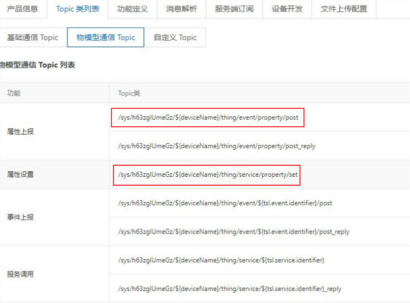
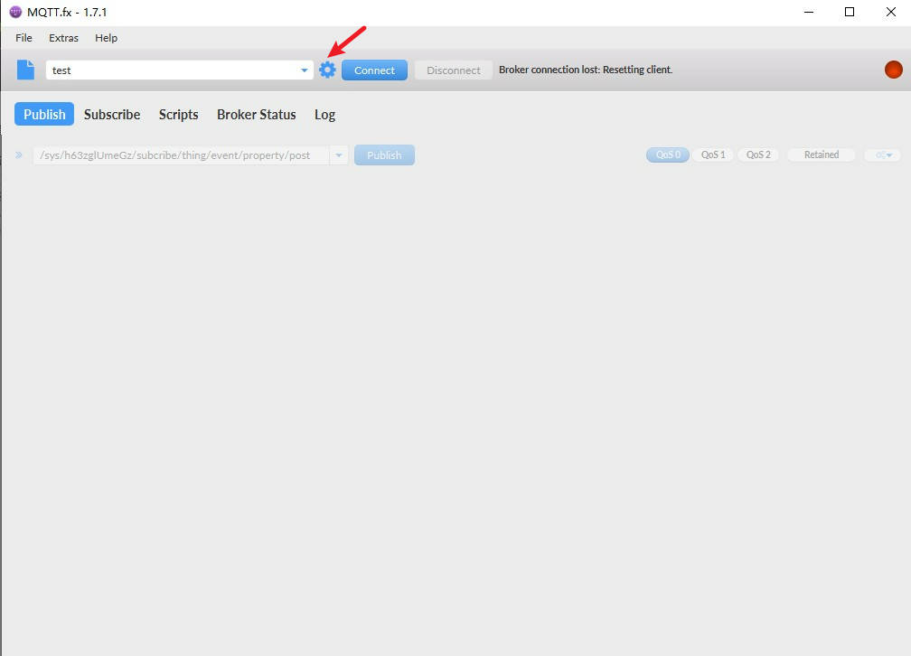
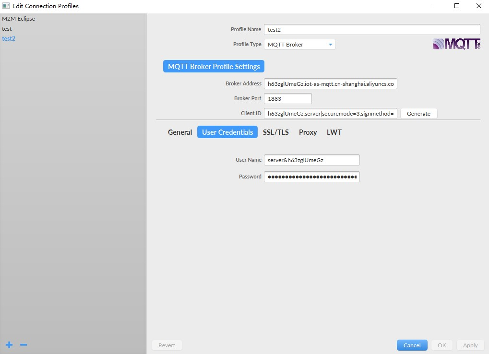
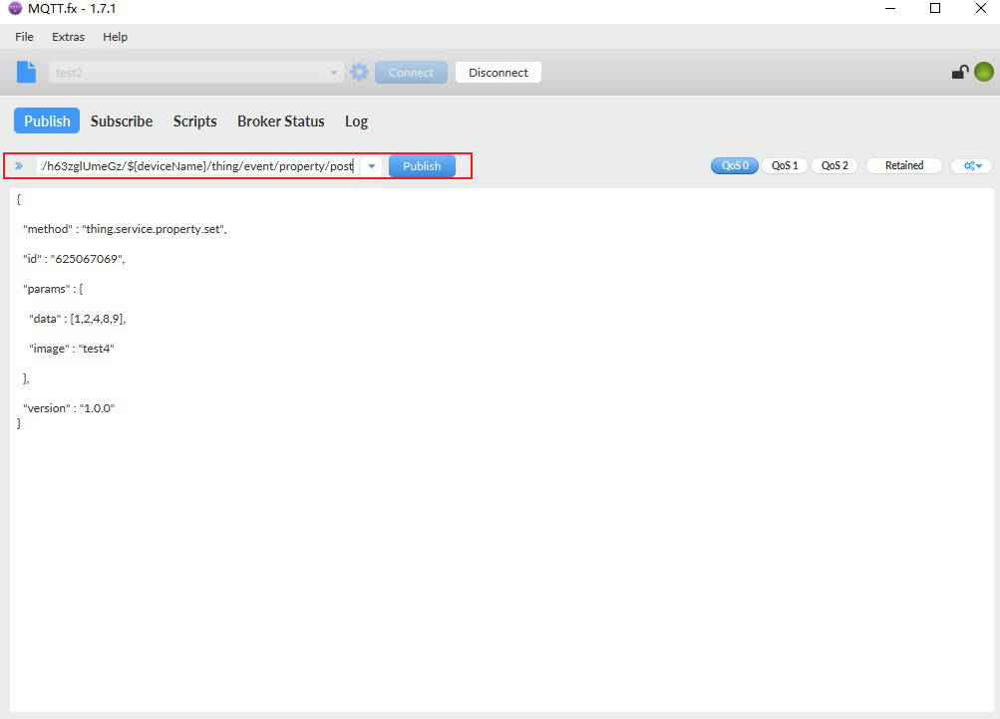
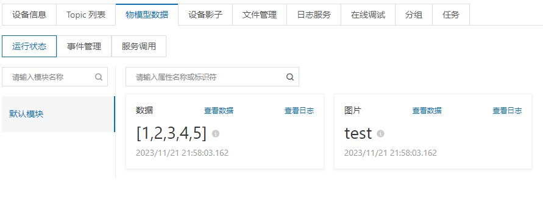
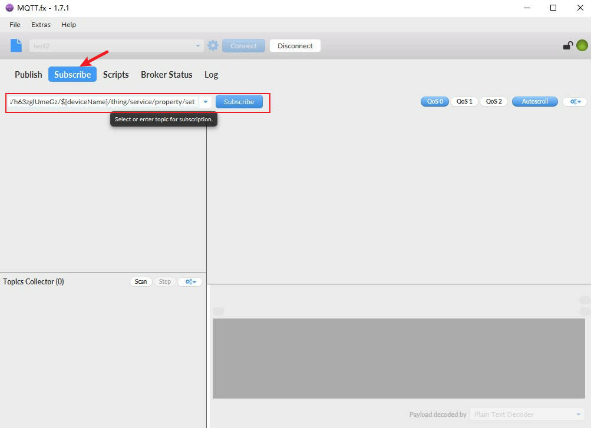
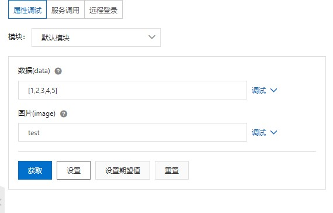
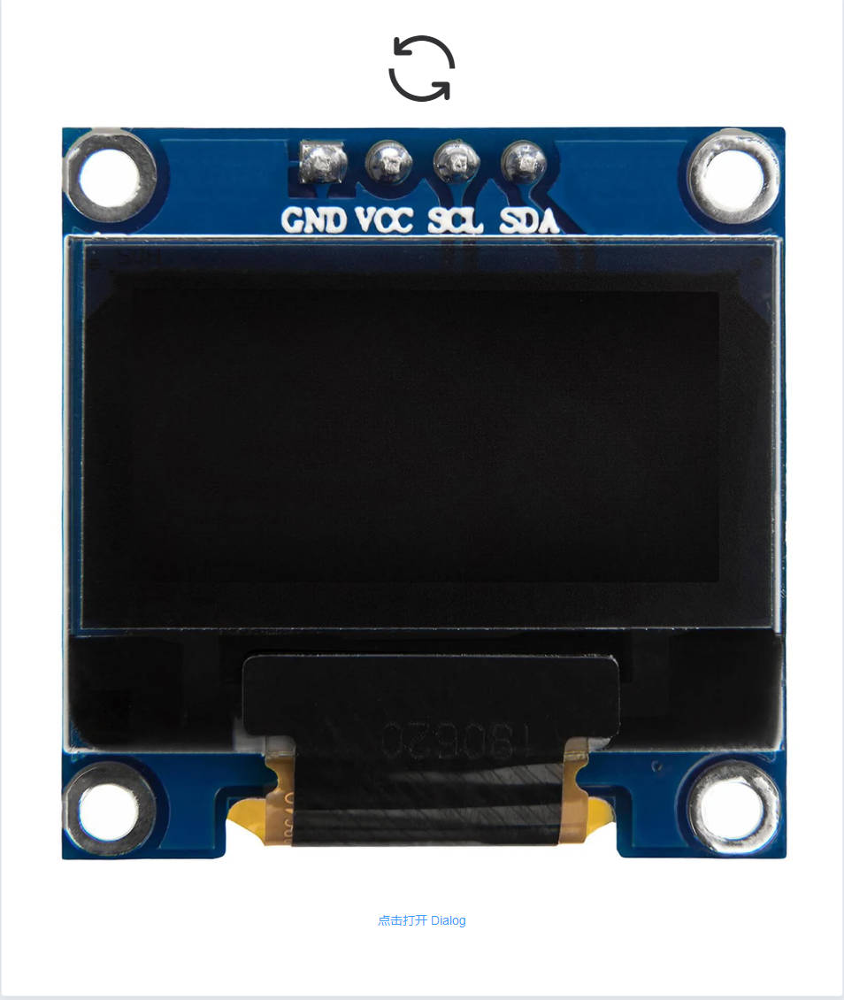
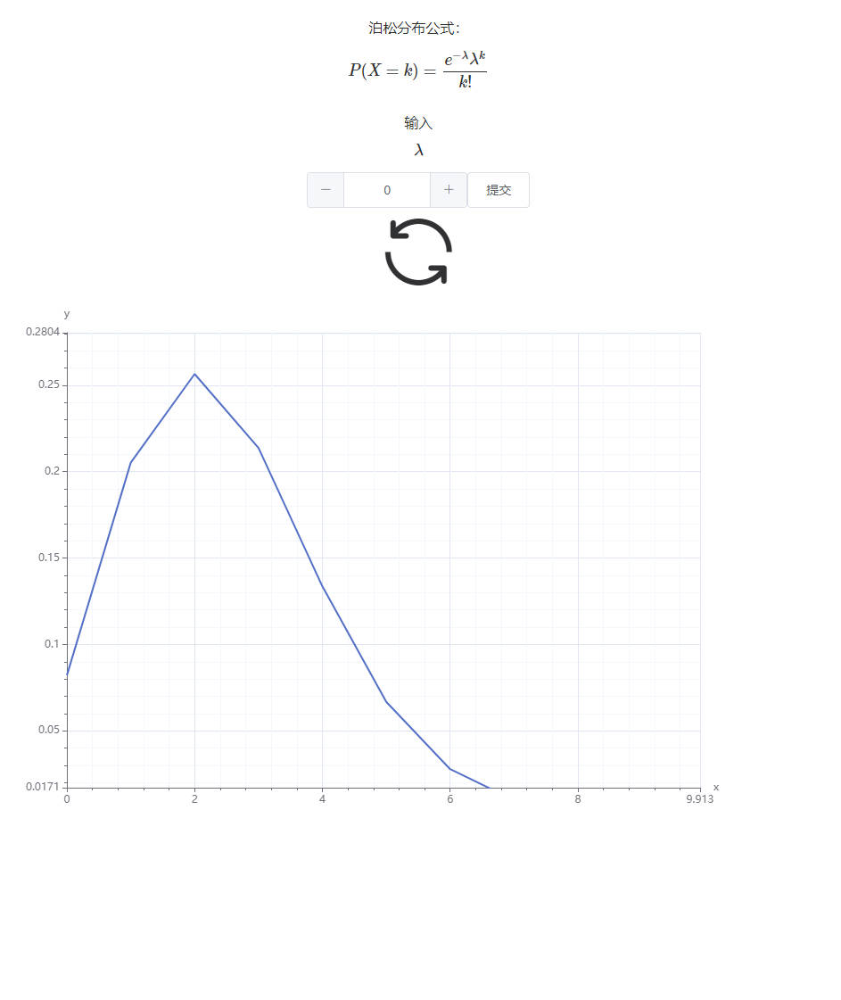
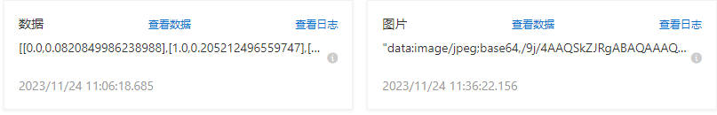

使用MQTT.fx来理解Mqtt是如何进行消息发布和接收；使用Java连接阿里物联网平台进行消息的订阅及发布；使用vue构建前端页面

<!-- more -->

### 使用MQTT.fx接入物联网平台

使用MQTT.fx来理解Mqtt是如何进行消息发布和接收的。

> 参考文档 https://help.aliyun.com/zh/iot/getting-started/using-mqtt-fx-to-access-iot-platform

#### 前提条件

| **参数**         | **值**                                                       |
| ---------------- | ------------------------------------------------------------ |
| **ProductKey**   | `a1***`                                                      |
| **DeviceName**   | `device1`                                                    |
| **DeviceSecret** | `f35***d9e`                                                  |
| **clientId**     | `a1***.device1|securemode=3,signmethod=hmacsha256,timestamp=2524608000000|` |
| **username**     | `device1&a1***`                                              |
| **passwd**       | `86761***21d`                                                |
| **mqttHostUrl**  | `a1***.iot-as-mqtt.cn-shanghai.aliyuncs.com`                 |
| **port**         | `1883`                                                       |

> passwd参考此文档 https://help.aliyun.com/zh/iot/user-guide/how-do-i-obtain-mqtt-parameters-for-authentication?spm=a2c4g.11186623.0.i50#task-2100587

#### 物模型通信Topic



#### MQTT.fx

1. 点击设置进入Edit connection profiles



2. 依次输入



3. 输入发布Topic



4. 查看物模型数据



5. 订阅Topic




6. 在线调试




### 源码

#### 前端

> github https://github.com/rxlxr11/AliYun-vue

##### 图片

通过upload组件将图片上传并base64编码，发送给后端，后端将base64上传至aliyun

```vue
<template>
  <div>
    <i class="el-icon-refresh"  @click="getImage"></i>
    <el-image :src=src></el-image>
    <el-button type="text" @click="dialogVisible = true">点击打开 Dialog</el-button>
    <el-dialog
        title="提示"
        :visible.sync="dialogVisible"
        width="30%"
        :before-close="handleClose">
      <el-upload
          class="upload-demo"
          ref="upload"
          :on-change= "getFile"
          :limit="1"
          list-type="picture"
          drag
          action="https://jsonplaceholder.typicode.com/posts/"
          :auto-upload="false">
        <i class="el-icon-upload"></i>
        <div class="el-upload__text">将文件拖到此处，或<em>点击上传</em></div>
        <div class="el-upload__tip" slot="tip">只能上传jpg/png文件，且不超过500kb</div>
      </el-upload>
      <span slot="footer" class="dialog-footer">
                <el-button @click="dialogVisible = false">取 消</el-button>
                <el-button type="primary" @click="submitUpload">上 传</el-button>
              </span>
    </el-dialog>
  </div>

</template>

<script>

import axios from "axios";
axios.defaults.headers.common['Content-Type'] = 'application/json';
export default {
  name: "RImage",
  data(){
    return{
      dialogVisible: false,
      src: '',
      base64: ''
    }
  },
  mounted() {
      this.getImage();
  },
  methods: {
    getImage(){
      axios.get("http://localhost:8080/imageBase64").then((result) => {
        this.src = result.data.payload;
        this.src = this.src.substring(1,this.src.length-1);
      });
    },
    submitUpload() {
      this.$refs.upload.submit();
      const data = this.base64;

      axios.post('http://localhost:8080/uploadImage', data)
          .then(response => {
            console.log(response.data.message);
          })
          .catch(error => {
            // 请求失败处理
            console.error(error);
          });
      alert("请求已发送");
    },
    handleClose(done) {
      this.$confirm('确认关闭？')
          .then(() => {
            done();
          })
          .catch(() => {});
    },
    getFile(file) {
      this.getBase64(file.raw).then(res => {
        console.log(res);
        this.base64 = res;
      });
    },
    getBase64(file) {
      return new Promise(function(resolve, reject) {
        let reader = new FileReader();
        let imgResult = "";
        reader.readAsDataURL(file);
        reader.onload = function() {
          imgResult = reader.result;
        };
        reader.onerror = function(error) {
          reject(error);
        };
        reader.onloadend = function() {
          resolve(imgResult);
        };
      });
    }

  }
}
</script>

<style scoped>

.el-icon-refresh{
  font-size: 100px;
}

.el-icon-refresh:hover{
  color: #407eff;
}
</style>
```

##### 图表

> echarts组件详情请访问https://echarts.apache.org/zh/index.html

```vue
//在Echarts.vue文件中
<template>
  <div>
    <i class="el-icon-refresh"  @click="getChart"></i>
    <div class="Echarts">
      <div :style="{ height: height, width: width }" :id="id"></div>
    </div>
  </div>

</template>

<script>
import axios from "axios";

let echarts = require("echarts/lib/echarts");

export default {

  // eslint-disable-next-line vue/multi-word-component-names
  name: "RChart",
  props: {
    height: {
      type: String,
      default: "600px",
    },
    width: {
      type: String,
      default: "800px",
    },
    id: {
      type: String,
      default: "demo",
    },
  },
  data() {
    return {
      chartData: [],
      loading: true
    };
  },
  mounted() {
    this.getChart();

  },
  methods: {
    getChart(){
      axios.get("http://localhost:8080/chartData").then((result) => {

        this.chartData = result.data.payload;
        this.drawLine(this.chartData);
      });
    },
    drawLine(data) {
      // 基于准备好的dom，初始化echarts实例
      console.log(this.id);
      let myChart = echarts.init(document.getElementById(this.id));
      // 绘制图表
      myChart.setOption({
        animation: false,
        grid: {
          top: 40,
          left: 50,
          right: 40,
          bottom: 50
        },
        xAxis: {
          name: 'x',
          minorTick: {
            show: true
          },
          minorSplitLine: {
            show: true
          }
        },
        yAxis: {
          name: 'y',
          min: 0,
          max: 1,
          minorTick: {
            show: true
          },
          minorSplitLine: {
            show: true
          }
        },
        dataZoom: [
          {
            show: true,
            type: 'inside',
            filterMode: 'none',
            xAxisIndex: [0],
            startValue: -20,
            endValue: 20
          },
          {
            show: true,
            type: 'inside',
            filterMode: 'none',
            yAxisIndex: [0],
            startValue: -20,
            endValue: 20
          }
        ],
        series: [
          {
            type: 'line',
            showSymbol: false,
            clip: true,
            data: data
          }
        ]
      });
    },
  },
};
</script>


<style scoped>
.el-icon-refresh{
  font-size: 100px;
}

.el-icon-refresh:hover{
  color: #407eff;
}
</style>
```

##### 主页

> 前端使用mathjax参考文档https://blog.csdn.net/yehaocheng520/article/details/118543885

输入$$\lambda$$并发送至后端，后端生成数据上传至aliyun

```vue
<template>
  <el-container>
<!--    <el-header>Header</el-header>-->
    <el-main>
      <el-row style="height: 100%">
        <el-col style="height: 100%;width: 50%">
          <el-card style="height: 90%;width: 90%">

            <r-image></r-image>
          </el-card>
        </el-col>
        <el-col style="height: 100%;width: 50%">
          <el-card style="height: 90%;width: 90%">
            <span class="spanCls">
              <span>泊松分布公式：</span>
              {{poissonFormat}}
              <br>
              <span>输入</span>
              {{lambda}}
            </span>


            <el-input-number v-model="input"></el-input-number>
            <el-button @click="submitPoisson">提交</el-button>

            <r-chart></r-chart>
          </el-card>
        </el-col>
      </el-row>

    </el-main>
  </el-container>
</template>

<script>
import axios from "axios";
import RImage from "@/components/RImage.vue";
import RChart from "@/components/RChart.vue";
axios.defaults.headers.common['Content-Type'] = 'application/json';

export default {
  name: "IndexView",
  components: {RChart, RImage},

  data() {
    return {
      poissonFormat: `$$P(X=k)=\\frac {e^{-\\lambda}\\lambda^k} {k!}$$`,
      lambda: `$$\\lambda$$`,
      input: 0.0
    };
  },
  mounted() {
    this.formatMath();
  },
  methods: {
    formatMath(){
      setTimeout(()=>{
        this.$nextTick(()=>{
          if(this.MathJax.isMathjaxConfig){
            this.MathJax.initMathjaxConfig();
          }
          //这个地方的hello是对应要渲染数学公式的dom的class
          this.MathJax.MathQueue('spanCls');
        })
      },500)
    },
    submitPoisson ()
    {
      const data = this.input

      axios.post('http://localhost:8080/poisson', data)
          .then(response => {
            console.log(response.data.message);
          })
          .catch(error => {
            // 请求失败处理
            console.error(error);
          });
      alert("请求已发送");
    }
  }

}
</script>

<style scoped>
body,html{
  height: 100%;
}

.el-container{
  height: 100vh;
  padding: 0;
}
.el-row{
  display: flex;
  align-content: center;
  justify-content: center;
}

.el-col{
  display: flex;
  align-content: center;
  justify-content: center;
}
.el-header{
  background-color: #B3C0D1;
  color: #333;
  padding: 10px;
  justify-content: center ;
  text-align: center;
  line-height: 10%;
}


.el-main {
  display: flex;
  align-content: center;
  justify-content: center;
  height: 100%;
  background-color: #E9EEF3;
  color: #333;
  text-align: center;
  line-height: 90%;
  padding: 0;
}

body>.el-container {
  margin-bottom: 40px;
  height: 100vh;
}

.el-card{
  margin: 50px;
  padding: 10px;
}

.picture{
  height: 80%;
  width: 90%;
  border: #333333;
}
</style>
```

#### 后端

> github https://github.com/rxlxr11/AliYun

##### 参数和内容

```java
@Data
public class Product {
    private String ProductKey;
    private String ProductSecret;
    private String DeviceSecret;
    private String DeviceName;

    private String port = "1883";
    private String broker ;

    public Product (String productKey,String productSecret,String deviceSecret,String deviceName){
        this.ProductKey = productKey;
        this.ProductSecret = productSecret;
        this.DeviceSecret = deviceSecret;
        this.DeviceName = deviceName;
        this.broker = "ssl://" + this.ProductKey + ".iot-as-mqtt.cn-shanghai.aliyuncs.com" + ":" + port;
    }
}

@Data
@AllArgsConstructor
@NoArgsConstructor
public class Param {
    private double chartData[][] ;

    private String image;

}

@Data
@NoArgsConstructor
@AllArgsConstructor
public class Content {

    private String method;
    private String id;
    private Param params;
    private String version;

}

@Data
public class result {
    private boolean message;

    private Object payload;
}

```


##### 发布和订阅

>  参考代码 https://help.aliyun.com/zh/iot/use-cases/use-the-paho-mqtt-java-client?spm=a2c4g.11186623.0.i60#section-pnr-ywl-9yi

实现connect，subscribe，listen，publish，disconnect

```java
package com.rxlxr.aliyun.mqtt;

import com.alibaba.fastjson.JSON;
import com.fasterxml.jackson.databind.ObjectMapper;
import com.rxlxr.aliyun.entities.Content;
import com.rxlxr.aliyun.entities.Param;
import com.rxlxr.aliyun.entities.Product;

import org.eclipse.paho.client.mqttv3.*;
import org.eclipse.paho.client.mqttv3.persist.*;

import java.util.UUID;
public class PubAndSub {

    private Product product;
    private MqttSign sign;
    public MqttClient client;
    public Content content;

    public PubAndSub(Product p){
        this.product = p;
    }
    public void connect() throws Exception {

        this.sign = new MqttSign();
        sign.calculate(product.getProductKey(), product.getDeviceName(), product.getDeviceSecret());
        MemoryPersistence persistence = new MemoryPersistence();

        System.out.println("username: " + sign.getUsername());
        System.out.println("password: " + sign.getPassword());
        System.out.println("clientid: " + sign.getClientid());
        content = new Content("default","0",new Param(),"0");
        try {
            // Paho MQTT客户端。
            this.client = new MqttClient(product.getBroker(), sign.getClientid(), persistence);

            // Paho MQTT连接参数。
            MqttConnectOptions connOpts = new MqttConnectOptions();
            connOpts.setCleanSession(true);
            connOpts.setKeepAliveInterval(180);
            connOpts.setUserName(sign.getUsername());
            connOpts.setPassword(sign.getPassword().toCharArray());
            client.connect(connOpts);
            System.out.println("Broker: " + product.getBroker() + " Connected");

        }catch (MqttException e){
            System.out.println("reason " + e.getReasonCode());
            System.out.println("msg " + e.getMessage());
            System.out.println("loc " + e.getLocalizedMessage());
            System.out.println("cause " + e.getCause());
            System.out.println("excep " + e);
            e.printStackTrace();
        }

    }


    public void subscribe(String topicReply) throws MqttException {
        //String topicReply = "/sys/" + this.ProductKey + "/" + this.DeviceName + "/thing/service/property/set";
        this.client.subscribe(topicReply);
//        System.out.println("subscribe: " + topicReply);
    }

    public void listen(){
        this.client.setCallback(new MqttCallback() {
            @Override
            public void connectionLost(Throwable throwable) {
                System.out.println("connection Lost");

            }

            @Override
            public void messageArrived(String s, MqttMessage mqttMessage) throws Exception {
                System.out.println("Sub message");
                System.out.println("Topic : " + s);
                System.out.println(new String(mqttMessage.getPayload())); //打印输出消息payLoad
                String payLoad = new String(mqttMessage.getPayload());
                ObjectMapper objectMapper = new ObjectMapper();
                content = objectMapper.readValue(payLoad, Content.class);
            }

            @Override
            public void deliveryComplete(IMqttDeliveryToken iMqttDeliveryToken) {

            }
        });
    }
    public void listen(String topic, Param p) throws MqttException {
        //String topic = "/sys/" + this.ProductKey + "/" + this.DeviceName + "/thing/event/property/post";
        String param = JSON.toJSONString(p);
        String id = UUID.randomUUID().toString();
        Content c = new Content("thing.service.property.set",id,p,"1.0.0");
        String content = JSON.toJSONString(c);
        MqttMessage message = new MqttMessage(content.getBytes());
        message.setQos(0);
        this.client.publish(topic, message);
        System.out.println("publish: " + content);
    }

    public void disconnect() throws MqttException {
        this.client.disconnect();
        System.out.println("Disconnected");
    }
}

```

#### Controller

```java
package com.rxlxr.aliyun.controller;

import com.rxlxr.aliyun.entities.result;
import com.rxlxr.aliyun.service.AliService;
import lombok.extern.slf4j.Slf4j;
import org.eclipse.paho.client.mqttv3.MqttException;
import org.springframework.beans.factory.annotation.Autowired;
import org.springframework.web.bind.annotation.CrossOrigin;
import org.springframework.web.bind.annotation.RequestBody;
import org.springframework.web.bind.annotation.RequestMapping;
import org.springframework.web.bind.annotation.RestController;


@Slf4j
@RestController
public class AliController {
    @Autowired
    private AliService service;

    @CrossOrigin
    @RequestMapping("/chartData")
    public result getData(){
        log.info("get chart data");
        result r = service.dataHandle();
        r.setMessage(true);
        return r;
    }

    @CrossOrigin
    @RequestMapping("/imageBase64")
    public result getImage(){
        log.info("get image data");
        result r = service.imageHandle();
        r.setMessage(true);
        return r;
    }

    @CrossOrigin
    @RequestMapping("/poisson")
    public result SetData(@RequestBody Double a) throws MqttException {
        service.sendData(a);
        result r =  new result();
        r.setMessage(true);
        return r;
    }

    @CrossOrigin
    @RequestMapping("/uploadImage")
    public result SetImage(@RequestBody String base64) throws MqttException {
        service.sendImage(base64);
        result r =  new result();
        r.setMessage(true);
        return r;
    }
}

```

#### Service

```java
package com.rxlxr.aliyun.service;

import com.rxlxr.aliyun.dao.AliDao;
import com.rxlxr.aliyun.entities.Param;
import com.rxlxr.aliyun.entities.result;
import com.rxlxr.aliyun.mqtt.PubAndSub;
import com.rxlxr.aliyun.utils.Poisson;
import lombok.extern.slf4j.Slf4j;
import org.eclipse.paho.client.mqttv3.MqttException;
import org.springframework.beans.factory.annotation.Autowired;
import org.springframework.stereotype.Service;

import static com.rxlxr.aliyun.AliYunApplication.pubAndSub;


@Slf4j
@Service
public class AliService {
    @Autowired
    private AliDao aliDao;

    public result dataHandle(){
        Param p = aliDao.getContent();

        result r = new result();
        r.setPayload(p.getChartData());
        return r;
    }

    public result imageHandle(){
        Param p = aliDao.getContent();
        result r = new result();
        r.setPayload(p.getImage());
        return r;
    }

    public void sendData(Double a) throws MqttException {
        String topic = "/sys/h63zglUmeGz/server/thing/event/property/post";
        String dataTopic = "/h63zglUmeGz/server/user/data";
        pubAndSub.content.getParams().setChartData(Poisson.poissonArray(a.doubleValue(),200));
        pubAndSub.publish(topic,pubAndSub.content.getParams());
        pubAndSub.publish(dataTopic,pubAndSub.content.getParams());
    }

    public void sendImage(String base64) throws MqttException {
        String topic = "/sys/h63zglUmeGz/server/thing/event/property/post";
        String imageTopic = "/h63zglUmeGz/server/user/image";
        pubAndSub.content.getParams().setImage(base64);
        pubAndSub.publish(topic,pubAndSub.content.getParams());
        pubAndSub.publish(imageTopic,pubAndSub.content.getParams());
    }
}

```

#### Dao

```java
package com.rxlxr.aliyun.dao;


import com.alibaba.fastjson.JSON;
import com.rxlxr.aliyun.entities.Content;
import com.rxlxr.aliyun.entities.Param;
import com.rxlxr.aliyun.mqtt.PubAndSub;
import lombok.extern.slf4j.Slf4j;
import org.springframework.stereotype.Repository;

import static com.rxlxr.aliyun.AliYunApplication.pubAndSub;

@Slf4j
@Repository
public class AliDao {

    public Param getContent(){
        Param p = pubAndSub.content.getParams();
        log.warn(JSON.toJSONString(pubAndSub.content.getParams()));
        return p;
    }

}

```


### 结果






