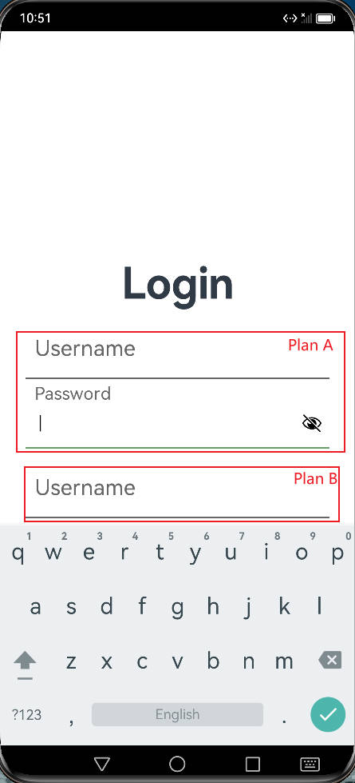

使用ArkTs自定义组件创建浮动输入框案例

<!-- more -->

### 结果展示

使用PlanA和PlanB来实现自定义组件，PlanA较为繁琐，但能成功实现浮动输入框效果，PlanB简单但无法触发onFocus等事件，若有大佬知道如何解决该问题可以指导我一下。



### PlanA

#### 自定义Label类

由于ArkTS没有label组件，所以自定义一个label类，当输入框onFocus时，label字体缩小并上移。

起初只定义了文本、字体大小、位置三个属性变量，如果这样定义，其他页面导入自定义组件时，无法灵活更改标签属性。故为了提高代码的灵活性，定义了在输入框不同状态时标签的文本、字体大小、位置，如此让代码显得有些复杂。其他组件或页面使用该类创建对象时可读性也大大降低。

##### 创建对象

```typescript
username_label = new rxLabel('Username',25,20,40,30,40,5)
```

##### Label定义

```typescript
export class rxLabel {
  Text: string;
  FontSize: number;

  FontSize_Focus: number;
  FontSize_Blur: number;

  Position_x: number;
  Position_y: number;

  Position_Blur_x: number;
  Position_Blur_y: number;

  Position_Focus_x: number;
  Position_Focus_y: number;

  constructor(text: string,
              fontSize: number, fontSize_focus: number,
              position_x: number, position_y: number,
              position_focus_x: number, position_focus_y: number) {
    this.Text = text

    this.FontSize = fontSize
    this.FontSize_Blur = fontSize
    this.FontSize_Focus = fontSize_focus

    this.Position_Blur_x = position_x
    this.Position_Blur_y = position_y

    this.Position_x = position_x
    this.Position_y = position_y

    this.Position_Focus_x = position_focus_x
    this.Position_Focus_y = position_focus_y
  }

}
```

#### 自定义Input类

输入框和自带输入框差别不大，只是以标签作为placeholder，当输入框onFocus时，边框颜色改变。label为可选参数。

当输入框onFocus时，调用focus函数，当输入框onBlur时，调用Blur函数。

##### 可选参数函数

如果函数定义了参数则必须传递这些参数否则报错，如果不想传递这些参数，可以添加 `?` ，语法如下：

```typescript
function func_name(param1: paramType, param2?: paramType) {
}
```

##### 创建对象

```typescript
username_input = new rxInput(InputType.Normal,'#666666','#6b9d68',this.username_label)
```

##### input定义

```typescript
export class rxInput {
  Label: rxLabel;

  BottomColor: string;

  BottomColor_Blur: string
  BottomColor_Focus: string;

  Type: number;
  Value: string = '';

  constructor(type: number = InputType.Normal, bottomColor: string,
              bottomColor_focus: string, label?: rxLabel)
  {
    this.Type = type
    this.BottomColor = bottomColor
    this.BottomColor_Blur = bottomColor
    this.BottomColor_Focus = bottomColor_focus
    if (label){
      this.Label = label
    }
  }

  focus(fontSize: number, x?: number, y?: number) {

    if (this.Label != null && x != null && y != null){
      this.Label.FontSize = fontSize
      this.Label.Position_x = x
      this.Label.Position_y = y
    }

    this.BottomColor = this.BottomColor_Focus
  }

  blur(fontSize: number, x?: number, y?: number)
  {
    if (this.Label != null && x != null && y != null && this.Value == ''){
      this.Label.FontSize = fontSize
      this.Label.Position_x = x
      this.Label.Position_y = y
    }

    this.BottomColor = this.BottomColor_Blur
  }

}

```

#### 自定义组件

在创建label和input对象时为组件赋值

```typescript
ExInput({rx_input:this.username_input})
```

1. 使用RelativeContainer或stack等容器达到label和input堆叠的效果
2. 输入框border四边只设置底边宽度
3. 使用属性动画达到过渡的效果

##### 源码

```typescript
@Component
export struct ExInput {
  @State private rx_input : rxInput = null
  build() {
    Column({space: 10}) {
      RelativeContainer() {

        TextInput()
          .id("input")
          .type(this.rx_input.Type)
          .width(350)
          .fontSize(25)
          .aspectRatio(6)
          .backgroundColor('#ffffff')
          .caretColor(Color.Black)
          .border({
            color: this.rx_input.BottomColor,
            width: {
              bottom: 2
            },
            radius: 0,
            style: BorderStyle.Solid
          })
          .alignRules({
            middle: {
              anchor: "__container__",
              align:HorizontalAlign.Center
            },
            bottom: {
              anchor: "__container__",
              align:VerticalAlign.Bottom
            }
          })
          .onChange((value) => {
            this.rx_input.Value = value;
          })
          .onFocus(() => {
            this.rx_input.focus(
              this.rx_input.Label.FontSize_Focus,
              this.rx_input.Label.Position_Focus_x,
              this.rx_input.Label.Position_Focus_y)
          })
          .onBlur(() => {
            this.rx_input.blur(
              this.rx_input.Label.FontSize_Blur,
              this.rx_input.Label.Position_Blur_x,
              this.rx_input.Label.Position_Blur_y)
          })

        Text(this.rx_input.Label.Text)
          .id("label")
          .fontColor('#666666')
          .fontSize(this.rx_input.Label.FontSize)
          .position({
            x: this.rx_input.Label.Position_x,
            y: this.rx_input.Label.Position_y
          })
          .animation({
            duration: 300,
            curve: Curve.Friction,
            playMode: PlayMode.Normal
          })
      }
      .width("100%")
      .height(80)
      .backgroundColor(Color.White)
    }
  }
}
```

### PlanB

设置文本、字体大小、位置、内容、类别、颜色作为属性并设置默认值，在创建组件时为其赋值

```typescript
TestInput({
          Type: InputType.Normal,
          Text: 'Username',
          FontSize: this.fz,
          BottomColor: this.bc,
          Position_x: this.px,
          Position_y: this.py
        })
```

#### 源码

```typescript

@Component
export struct TestInput {

  Text: string;
  FontSize: number = 25;

  Position_x: number = 40;
  Position_y: number = 30;

  BottomColor: string = '#666666';

  Type: number;
  Value: string = '';

  onClick: (event: (event?: ClickEvent) => void) => CommonAttribute;
  onFocus: (event: () => void) => CommonAttribute

  build() {
    Column({space: 10}) {
      RelativeContainer() {
        TextInput()
          .id("input")
          .type(this.Type)
          .width(350)
          .fontSize(25)
          .aspectRatio(6)
          .backgroundColor('#ffffff')
          .caretColor(Color.Black)
          .border({
            color: this.BottomColor,
            width: {
              bottom: 2
            },
            radius: 0,
            style: BorderStyle.Solid
          })
          .alignRules({
            middle: {
              anchor: "__container__",
              align:HorizontalAlign.Center
            },
            bottom: {
              anchor: "__container__",
              align:VerticalAlign.Bottom
            }
          })
          .onChange((value) => {
            this.Value = value;
          })

        Text(this.Text)
          .id("label")
          .fontColor('#666666')
          .fontSize(this.FontSize)
          .position({
            x: this.Position_x,
            y: this.Position_y
          })
          .animation({
            duration: 300,
            curve: Curve.Friction,
            playMode: PlayMode.Normal
          })
      }
      .width("100%")
      .height(80)
      .backgroundColor(Color.White)
    }
  }
}
```

### 导入自定义组件

对PlanB无法处理事件的解决方法包括以下，但没能成功，若有大佬知道怎样正确使用，不胜感激

1. 使用'@ohos.events.emitter'
2. 在自定义组件中声明onclick等函数

```typescript
import {ExInput, rxInput, rxLabel} from './main/widgets/ExInput'
import { TestInput } from './main/widgets/TestInput'

@Entry
@Component
struct Index {
  @State message: string = 'Login'
  username_label = new rxLabel('Username',25,20,40,30,40,5)
  username_input = new rxInput(InputType.Normal,'#666666','#6b9d68',this.username_label)
  pwd_label = new rxLabel('Password',25,20,40,30,40,5)
  pwd_input = new rxInput(InputType.Password,'#666666','#6b9d68',this.pwd_label)
  @State fz : number =25
  @State bc : string = '#666666'
  @State px : number = 40
  @State py : number = 30

  build() {
    Row() {
      Column() {
        Text(this.message)
          .fontSize(50)
          .fontWeight(FontWeight.Bold)
        ExInput({rx_input:this.username_input})
        ExInput({rx_input:this.pwd_input})

        TestInput({
          Type: InputType.Normal,
          Text: 'Username',
          FontSize: this.fz,
          BottomColor: this.bc,
          Position_x: this.px,
          Position_y: this.py
        })
          .animation({
            duration: 300,
            curve: Curve.Friction,
            playMode: PlayMode.Normal
          })
          .onClick(() => {
            console.warn("test1")
            this.fz = 20
            this.bc = '#6b9d68'
            this.px = 40
            this.py = 5
          })
          .onFocus(() => {
            console.warn("test2")
            this.fz = 20
            this.bc = '#6b9d68'
            this.px = 40
            this.py = 5
          })
          .onBlur(()=>{
            this.fz = 25
            this.bc = '#666666'
            this.px = 40
            this.py = 30
          })
      }
      .width('100%')
    }
    .height('100%')
  }
}


```

