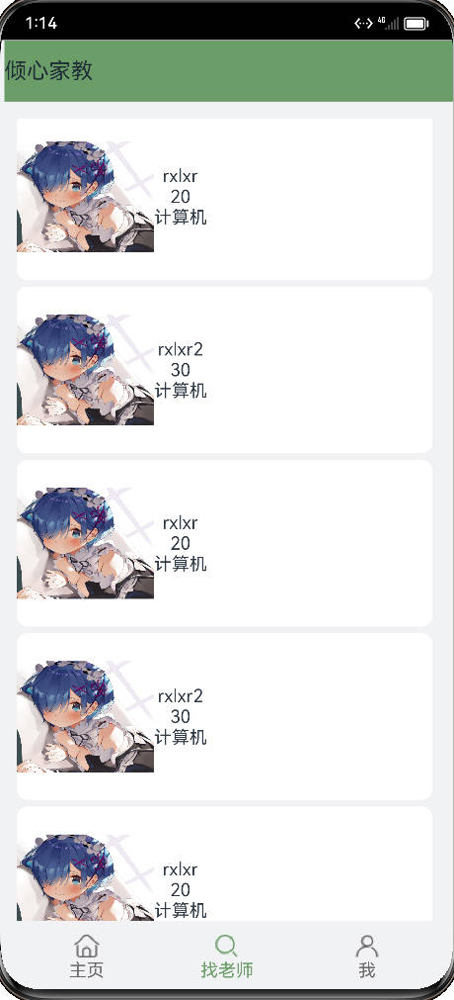
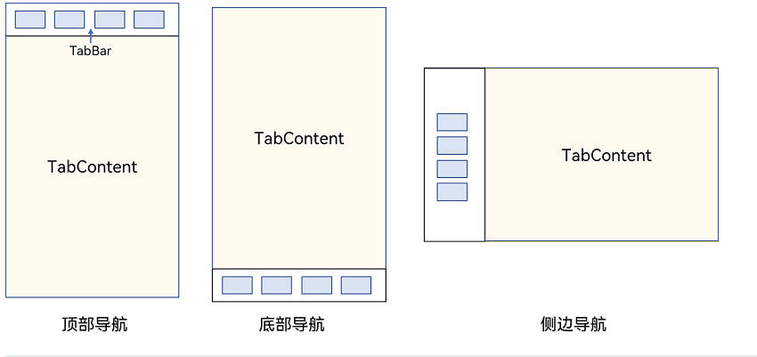

学习使用ArkTs的`List`，`Tabs`，`Navigation`等组件

<!-- more -->

### 开发环境

- 开发工具 `DevEco Studio`
- 语言 `ArkTS`
- SDK `3.1.0(API9)`

### 结果展示




### List组件使用

`List`是很常用的滚动类容器组件之一，它按照水平或者竖直方向线性排列子组件， `List` 的子组件必须是 `ListItem`。

使用`ForEach`对每个`item`渲染。


```typescript
import {Card} from '../compoment/Card'
import { brief } from '../entity/brief'

@Component
export struct FindContent {
  @State briefItem: brief = new brief("rxlxr", 20, '计算机', 100, 'http://www.rxlxr.com/images/user/avatar.png')
  @State briefItem2: brief = new brief("rxlxr2", 30, '计算机', 50, 'http://www.rxlxr.com/images/user/avatar.png')
  items: brief[] = [this.briefItem2, this.briefItem2, this.briefItem, this.briefItem2, this.briefItem, this.briefItem2, this.briefItem];

  build() {
    List() { // List默认竖直方向排列子组件
      ForEach(this.items, (item: any, index?: number) => {
        ListItem() {
          Card({
            Content: item,
            Color: '#ffffff',
            Width: 375,
            Height: 150
          })
        }
      })
    }
    .height('100%')
    .width('100%')
    .divider({
      strokeWidth: 6,   // 设置分割线宽度
      color: '#f1f2f4'
    })
  }
}
```

### 导航组件

Tabs，Navigation作为导航组件都可以提高页面空间利用率。

#### Navigation

Navigation组件的页面包含主页和内容页。主页由标题栏、内容区和工具栏组成。通过工具栏同样可以实现与Tabs类似的效果，但是内容页是属于Navigation而不是ToolBar。

本次实例主要使用标题栏所以主要讲解标题栏的使用，想要了解更多，请参考

> [官方文档](https://developer.huawei.com/consumer/cn/doc/harmonyos-references-V2/ts-basic-components-navigation-0000001478341133-V2)

设置导航栏的标题，当参数类型为 string 时，可以直接设置标题，但样式不支修改；当参数为 `CustomBuilder` 时，可以自定义标题样式。

##### NavigationTitleMode枚举说明

| 名称 | 描述                                                         |
| :--- | :----------------------------------------------------------- |
| Free | 当内容为可滚动组件时，标题随着内容向上滚动而缩小（子标题的大小不变、淡出）。向下滚动内容到顶时则恢复原样。 |
| Mini | 固定为小标题模式。                                           |
| Full | 固定为大标题模式。                                           |

**hideBackButton**：是否隐藏返回按钮，默认情况下不隐藏.返回键仅针对`titleMode`为`NavigationTitleMode.Mini`时才生效

```typescript
@Builder title() {// 通过Builder自定义标题栏，可以灵活的设置标题样式
      Row() {

        Text('倾心家教')
          .fontSize(20)
      }
      .width('100%')
      .height(55)
      .margin(0)
      .margin({
        left: -20
      })
      .backgroundColor('#6b9d68')

  }
```

#### Tabs

Tabs组件的页面组成包含两个部分，分别是TabContent和TabBar。TabContent是内容页，TabBar是导航页签栏，页面结构如下图所示，根据不同的导航类型，布局会有区别，可以分为底部导航、顶部导航、侧边导航，其导航栏分别位于底部、顶部和侧边。

每一个TabContent对应的内容需要有一个页签，可以通过TabContent的tabBar属性进行配置。在如下TabContent组件上设置属性tabBar，可以设置其对应页签中的内容，tabBar作为内容的页签。



```typescript

import { FindContent } from '../content/FindContent'
import { HomeContent } from '../content/HomeContent'
import { UserContent } from '../content/UserContent'
@Entry
@Component
struct Index {
  @State currentIndex: number = 0

  @Builder title() {// 通过Builder自定义标题栏，可以灵活的设置标题样式
      Row() {

        Text('倾心家教')
          .fontSize(20)
      }
      .width('100%')
      .height(55)
      .margin(0)
      .margin({
        left: -20
      })
      .backgroundColor('#6b9d68')

  }

  @Builder tabBuilder(index: number, title: string, selectedImage: Resource, normalImage: Resource) {
    Column() {
      Image(this.currentIndex == index ? selectedImage : normalImage)
        .size({width: 25, height:25})
      Text(title)
        .fontColor(this.currentIndex == index ? '#6b9d68' : '#6B6B6B')
    }
    .padding(10)
    .width(70)
    .height('100%')
    .justifyContent(FlexAlign.Center)
  }

  build() {
    Navigation() {
      Tabs({
        index: this.currentIndex,
        barPosition: BarPosition.End
      }){
        TabContent() {
          HomeContent()
        }
        .tabBar(this.tabBuilder(0, '主页', $r('app.media.home_select'), $r('app.media.home')))

        TabContent() {
          FindContent()
        }
        .tabBar(this.tabBuilder(1, '找老师', $r('app.media.search_select'), $r('app.media.search')))

        TabContent() {
          UserContent()
        }
        .tabBar(this.tabBuilder(2, '我', $r('app.media.user_select'), $r('app.media.user')))

      }
      .margin(15)
      .barMode(BarMode.Fixed)
      .onChange((index) => {
        this.currentIndex = index
      })

      //   .backgroundColor('#aabbcc')
    }
    .backgroundColor('#f1f2f4')
    .size({width: '100%', height: '100%'})
    .title(this.title())
    .titleMode(NavigationTitleMode.Mini)
    .hideBackButton(true)
    .width('100%').height('100%')
    .hideToolBar(true)
  }
}
```