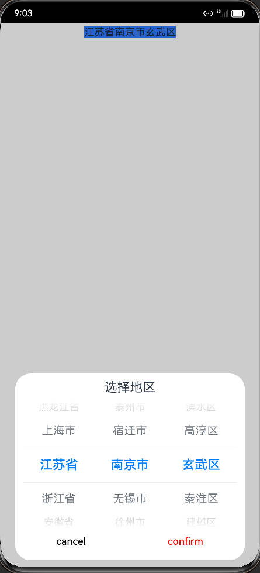

使用Picker，Dialog组件完成中国城市选择器
<!-- more -->

### 开发环境

- 开发工具 `DevEco Studio`
- 语言 `ArkTS`
- SDK `3.1.0(API9)`

### 结果展示



### 数据获取

#### JSON数据格式
```typescript
class  City {
  code: string;
  name: string;
  children?: City[];
}
```
#### 数据初始化

使用数组的foreach函数和push函数将数据存入字符串数组

> 使用push时要注意对象得初始化，否则会报Obj is not a Valid object

```typescript
  aboutToAppear(){
    console.warn("appear")
    CityData.forEach( (item1,index1) => {
      Province.push(item1.name);
      City[index1] = []
      item1.children.forEach((item2,index2) => {
        City[index1].push(item2.name)
        if (Area[index1]==null)
          Area[index1] = []
        Area[index1][index2] = []
        item2.children.forEach(item3 => {
          Area[index1][index2].push(item3.name);
        })
      })
    })
  }
```
### 自定义Dialog

#### Picker

PIcker分为DatePicker，TimePicker，和TextPicker，此处使用TextPicker。

##### 参数：

| 参数名   | 参数类型                                                     | 必填 | 参数描述                                                     |
| -------- | ------------------------------------------------------------ | ---- | ------------------------------------------------------------ |
| range    | string[] \| [Resource](https://developer.harmonyos.com/cn/docs/documentation/doc-references-V3/ts-types-0000001477981241-V3#ZH-CN_TOPIC_0000001573928889__resource类型) | 是   | 选择器的数据选择列表。                                       |
| selected | number                                                       | 否   | 设置默认选中项在数组中的索引值。默认值：0                    |
| value    | string                                                       | 否   | 设置默认选中项的值，优先级低于selected。默认值：第一个元素值 |

#### Dialog

`CustomDialogController` 定义了 `open()` 和 `close()` 方法，它们说明如下：

- **open**：打开对话框，如果对话框已经打开，则再次打开无效。

- **close**：关闭对话框，如果对话框已经关闭，则再次关闭无效。

- **value**：创建控制器需要的配置参数， `CustomDialogControllerOptions`
  说明如下：
  - **builder**：创建自定义弹窗的构造器。
  - **cancel**：点击蒙层的事件回调。
  - **autoCancel**：是否允许点击遮障层退出。
  - **alignment**：弹窗在竖直方向上的对齐方式。
  - **offset**：弹窗相对 `alignment` 所在位置的偏移量。
  - **customStyle**：弹窗容器样式是否自定义。

自定义对话框本质上也是自定义 UI 组件，只是自定义弹窗使用的修饰符为 `@CustomDialog` ，其它方面和自定义组件的流程是一致的.

#### 源码

```typescript
@CustomDialog
struct CustomDialogExample {

  @Link province: string
  @Link city: string
  @Link area: string

  @Link select1: number
  @Link select2: number
  @Link select3: number
  controller: CustomDialogController
  // 若尝试在CustomDialog中传入多个其他的Controller，以实现在CustomDialog中打开另一个或另一些CustomDialog，那么此处需要将指向自己的controller放在最后
  cancel: () => void
  confirm: () => void

  build() {
    Column() {
      Text('选择地区').fontSize(20).margin({ top: 10, bottom: 10 })
      Row(){
        TextPicker({ range: Province, selected: this.select1})
          .onChange((value: string, index: number) => {
            this.province = value;
            this.select1 = index;
            this.select2 = 0;
            this.select3 = 0;
          })
        TextPicker({ range: City[this.select1], selected: this.select2})
          .onChange((value: string, index: number) => {
            this.city = value;
            this.select2 = index;
            this.select3 = 0;
          })
        TextPicker({ range: Area[this.select1][this.select2], selected: this.select3})
          .onChange((value: string, index: number) => {
            this.area = value;
            this.select3 = index;
          })
      }
      Flex({ justifyContent: FlexAlign.SpaceAround }) {
        Button('cancel')
          .onClick(() => {
            this.controller.close()
            this.cancel()
          }).backgroundColor(0xffffff).fontColor(Color.Black)
        Button('confirm')
          .onClick(() => {
            // this.inputValue = this.textValue
            this.controller.close()
            this.confirm()
          }).backgroundColor(0xffffff).fontColor(Color.Red)
      }.margin({ bottom: 10 })
    }
    // dialog默认的borderRadius为24vp，如果需要使用border属性，请和borderRadius属性一起使用。
  }
}
```
### 使用自定义Dialog
```typescript
@Entry
@Component
struct CustomDialogCity {
  @State province: string = '北京市'
  @State city: string = '市辖区'
  @State area: string = '东城区'
  @State select1: number = 0
  @State select2: number = 0
  @State select3: number = 0
  dialogController: CustomDialogController = new CustomDialogController({
    builder: CustomDialogExample({
      cancel: this.onCancel,
      confirm: this.onAccept,
      province: $province,
      city: $city,
      area: $area,
      select1: $select1,
      select2: $select2,
      select3: $select3
    }),
    cancel: this.existApp,
    autoCancel: true,
    alignment: DialogAlignment.Bottom,
    offset: { dx: 0, dy: -20 },
    gridCount: 4,
    customStyle: false
  })


  aboutToAppear(){
    console.warn("appear")
    CityData.forEach( (item1,index1) => {
      Province.push(item1.name);
      City[index1] = []
      item1.children.forEach((item2,index2) => {
        City[index1].push(item2.name)
        if (Area[index1]==null)
          Area[index1] = []
        Area[index1][index2] = []
        item2.children.forEach(item3 => {
          Area[index1][index2].push(item3.name);
        })
      })
    })
  }

  // 在自定义组件即将析构销毁时将dialogController置空
  aboutToDisappear() {
    this.dialogController = undefined // 将dialogController置空
  }

  onCancel() {
    console.info('Callback when the first button is clicked')
  }

  onAccept() {
    console.info('Callback when the second button is clicked')
  }

  existApp() {
    console.info('Click the callback in the blank area')
  }

  build() {
    Column() {
      Text(this.province + this.city + this.area)
        .onClick(() => {
          if (this.dialogController != undefined) {
            this.dialogController.open()
          }
        }).backgroundColor(0x317aff)

    }.width('100%').margin({ top: 5 })
  }


}
```

