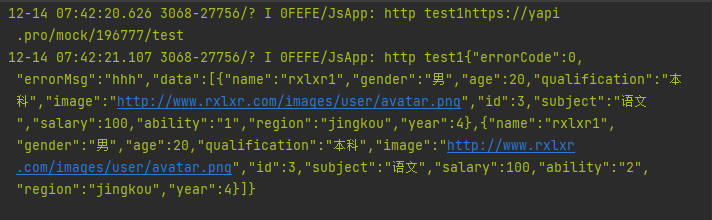

使用http协议获取数据
<!-- more -->

### 开发环境

- 开发工具 `DevEco Studio`
- 语言 `ArkTS`
- SDK `3.1.0(API9)`

### 结果展示




### 数据获取

#### 结构体

##### Response

```typescript
export class Response {
  /**
   * Code returned by the network request: success, fail.
   */
  errorCode: number;

  /**
   * Message returned by the network request.
   */
  errorMsg: string | Resource;

  /**
   * Data returned by the network request.
   */
  data: string | Object | ArrayBuffer;

  constructor() {
    this.errorCode = 0;
    this.errorMsg = '';
    this.data = '';
  }

}
```
##### Data
```typescript
export default class Teacher{

  id: number;
  name: string;
  gender: string;
  age: number;
  qualification: string;
  image: string | Resource;
  subject: string;
  salary: number;
  ability: string;
  region: string;
  year: number;

}
```
#### 返回数据设置

```json
{
  "errorCode": 0,
  "errorMsg": "hhh",
  "data": [
    {
      "name": "rxlxr1",
      "gender": "男",
      "age": 20,
      "qualification": "本科",
      "image": "http://www.rxlxr.com/images/user/avatar.png",
      "id": 3,
      "subject": "语文",
      "salary": 100,
      "ability": "1",
      "region": "jingkou",
      "year": 4
    },
    {
      "name": "rxlxr1",
      "gender": "男",
      "age": 20,
      "qualification": "本科",
      "image": "http://www.rxlxr.com/images/user/avatar.png",
      "id": 3,
      "subject": "语文",
      "salary": 100,
      "ability": "2",
      "region": "jingkou",
      "year": 4
    }
  ]
}
```

#### 其他
```typescript
export class API {
  //读取超时
  static readonly HTTP_READ_TIMEOUT = 10 * 1000
  /**
   * Http请求成功的code.
   */
  static readonly HTTP_CODE_200: number = 200;
  /**
   * wanAndroid 接口返回的成功的code.
   */
  static readonly SERVER_CODE_SUCCESS: number = 0;
}

export const enum IState {
  Loading = 0,
  Success = 1,
  Fail = 2
}
```
### 源码分析

#### request

> 为了能让异步操作更可控，最好使用Promise

```typescript
request(url: string, callback: AsyncCallback<HttpResponse>): void;

request(url: string, options: HttpRequestOptions, callback: AsyncCallback<HttpResponse>): void;

request(url: string, options?: HttpRequestOptions): Promise<HttpResponse>;
```

#### get(url)

> 使用http的get方法获取数据并返回Response对象

```typescript
export function get(url: string): Promise<Response> {
  let httpRequest = http.createHttp();
  console.log("http test1"+url)
  let responseResult = httpRequest.request(url, {
    method: http.RequestMethod.GET,
    readTimeout: 15000,
    header: {
      'Content-Type': 'application/json'
    },
    connectTimeout: 15000,
    extraData: {}
  });
  let serverData: Response = new Response();
  // Processes the data and returns.
  return responseResult.then((value: http.HttpResponse) => {
    if (value.responseCode === API.HTTP_CODE_200) {
      // Obtains the returned data.
      let result = `${value.result}`;
      console.info("http test1"+result);

      let resultJson: Response = JSON.parse(result);
      //console.error("result2"+JSON.stringify(resultJson))
      if (resultJson.errorCode === API.SERVER_CODE_SUCCESS) {
        serverData.data = resultJson.data;
      }
      serverData.errorCode = resultJson.errorCode;
      serverData.errorMsg = resultJson.errorMsg;
    } else {
      serverData.errorMsg = 'error1';
    }
    return serverData;
  }).catch(() => {
    serverData.errorMsg = 'error2';
    return serverData;
  })
}
```
#### getData()

> 将Response中的数据提取并返回

```typescript
export function getTeacher(): Promise<Teacher[]> {
  return new Promise((resolve: Function, reject: Function) => {
    get("https://yapi.pro/mock/196777/test").then((data: Response) => {
      if (data.errorCode === API.SERVER_CODE_SUCCESS) {
        resolve(data.data);
      } else {
        console.error('http test1 getBannerList failed1', JSON.stringify(data));
        reject('error3');
      }
    }).catch((err: Error) => {
      console.error('http test1 getBannerList failed2', JSON.stringify(err));
      reject('error4');
    });
  });
}
```
#### component
> 自定义组件，调用aboutToAppear()在页面生成前获取数据，之后只要在要使用该组件的页面直接调用该组件即可
```typescript
@Component
export struct Banner {

  private controller: SwiperController = new SwiperController();

  @State list: HomeModel = new HomeModel()

  requestTeacher() {
    getTeacher().then((data: Teacher[]) => {
      this.list.bannerData = [...data]
      this.list.status = IState.Success
    }).catch((err: string | Resource) => {
      this.list.status = IState.Fail
    })
  }

  aboutToAppear() {
    this.requestTeacher()
  }

  @Builder LoadingLayout() {
    Text('加载中...').width('100%').height('100%').textAlign(TextAlign.Center)
  }

  @Builder ShowData() {
    Swiper(this.controller) {
      ForEach(this.list.bannerData, (item: Teacher) => {
        Image(item.image)
      }, (item: Teacher, index?: number) => JSON.stringify(item) + index)
    }
    .width(200)
    .height(100)
    .indicatorStyle({ selectedColor: $r('app.color.start_window_background') })
    .indicator(true)
    .loop(true)
    .margin({ top: 5 })
    .autoPlay(true)

  }

  build() {

    if (this.list.status === IState.Loading) {
      this.LoadingLayout()
    } else {
      this.ShowData()
    }

  }
}
```
### 参考
> [WAndroidHOS](https://github.com/zqf-dev/WAndroidHOS)

