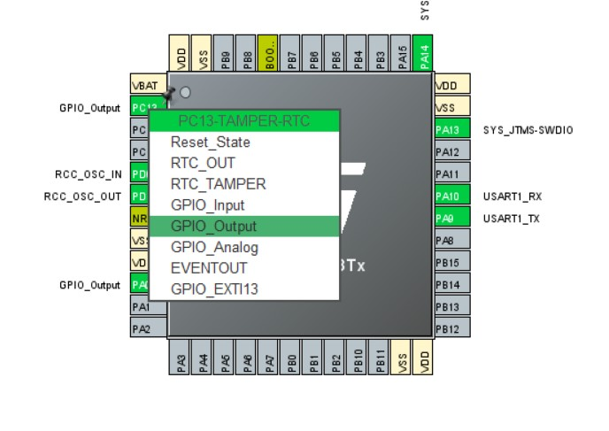
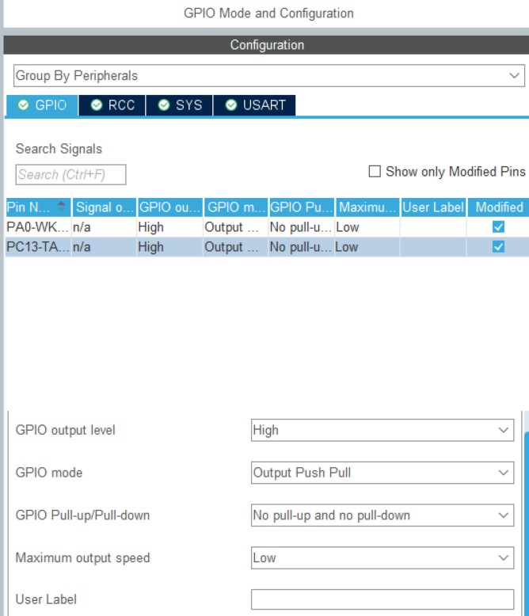
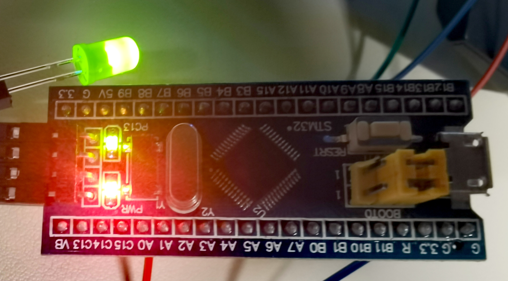

### 设置引脚

将PC13和PA0设置为GPIO_Output



将GPIO output level 设置为high



### 接线

发光二极管长脚为正极短脚为负极将短脚接到gnd，长脚接到PA0。

> 二极管需一边为高电平，另一边为低电平才能发光

### 编写代码

> 外接发光二极管负极永远是低电平所以当PA0设置为1时才会亮
>
> 内接led正极接3.3v（详情见手册）只有当PC13设置为0时才会亮

```c
  while (1)
  {
		HAL_Delay(1000);
		HAL_GPIO_WritePin(GPIOA, GPIO_PIN_0,GPIO_PIN_SET);
		HAL_GPIO_WritePin(GPIOC, GPIO_PIN_13,GPIO_PIN_RESET);
		HAL_Delay(1000);
		HAL_GPIO_WritePin(GPIOA, GPIO_PIN_0,GPIO_PIN_RESET);
		HAL_GPIO_WritePin(GPIOC, GPIO_PIN_13,GPIO_PIN_SET);
  }
```

### 结果

外接发光二极管和开发板上的led每隔一秒同时亮起同时熄灭


