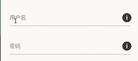
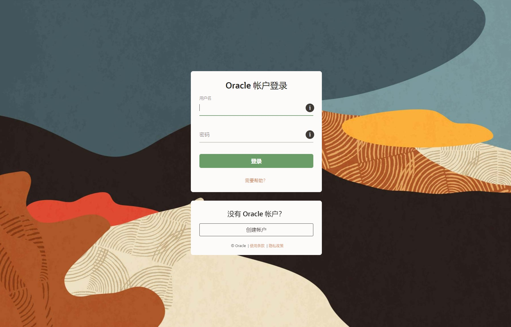
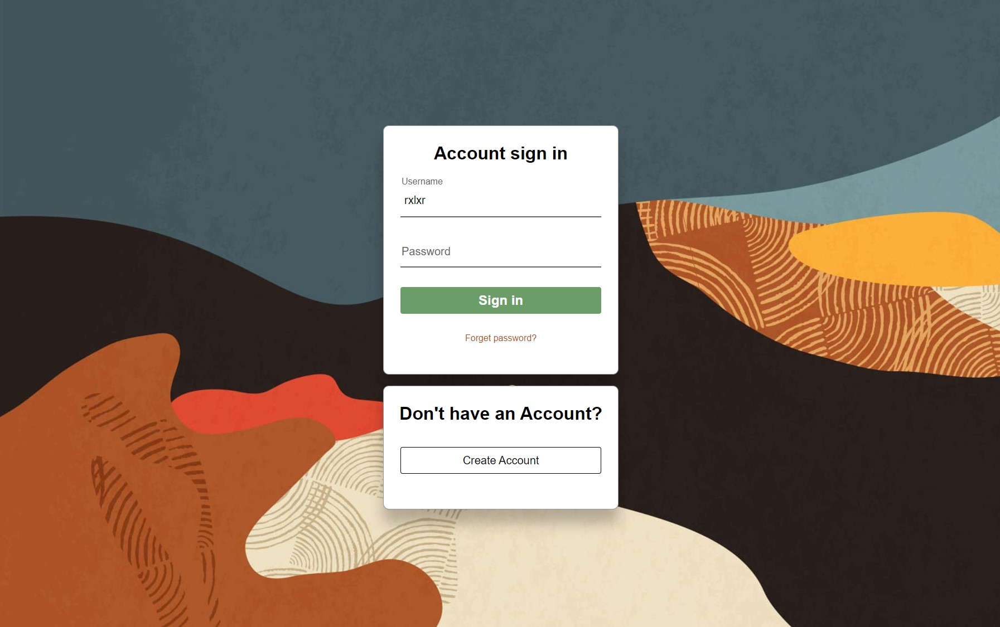
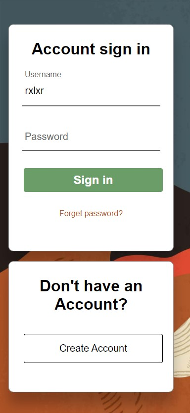

仿照Oracle登录界面

<!-- more -->

### 提示文字上移并缩小

css实现一下点击input输入框后提示文字上移并缩小效果如图



```html
<form id="login-form">
                <div class="Username">
                    <input type="text" id="username"  required>
                    <label for="username">Username</label>
                </div>
                <div class="Password">
                    <input type="password" id="password"  required>
                    <label for="password">Password</label>
                </div>
                
                <button type="button" id="login-button" onclick="login()">Sign in</button>
            </form>
<style>
    #login-form input {
    width: 90%;
    height: 3.75rem;
    font-size: 1.25rem;
    margin: 0.9375rem;
    padding: 0.4375rem;
    box-sizing: border-box;
    outline: none;
    border: none;
    border-bottom: 0.125rem solid #666666;
}

#login-form input:focus {
    border-bottom: 0.1875rem solid #6b9d68;
    outline: 0rem;
}


#login-form .Username{
    position: relative;
}

#login-form .Password{
    position: relative;
}

#login-form label{
    margin: 0.9375rem;
    padding: 0.4375rem;
    padding-top: 0.75rem;
    position: absolute;
    top: 0;
    left: 0;
    font-size: 1.25rem;
    color: #666666;
    transition: all 0.5s;
    line-height: 2.375rem;
}

#login-form input:focus + label,
#login-form input:valid + label{
    font-size:1rem;
    top: -2.1875rem;
}
</style>
```

### 结果

#### 原版



#### 仿制



##### 移动设备



### 代码

#### html

```html
<!DOCTYPE html>
<html lang="en">
<head>
    <meta charset="UTF-8">
    <meta name="viewport" content="width=device-width, initial-scale=1.0">
    <title>Login Page</title>
    <!-- 导入外部 CSS 文件 -->
    <link rel="stylesheet" href="login.css">
</head>
<body>
    <div class="column">
        <div id="login-container" class="container">
            <h1>Account sign in</h1>
            <form id="login-form">
                <div class="Username">
                    <input type="text" id="username"  required>
                    <label for="username">Username</label>
                </div>
                <div class="Password">
                    <input type="password" id="password"  required>
                    <label for="password">Password</label>
                </div>
                
                <button type="button" id="login-button" onclick="login()">Sign in</button>
            </form>
            <div id="reset-pwd">
                <a href="https://www.w3schools.cn/" target="_blank">Forget password?</a>
            </div>
            
        </div>

        <div id="reg-container" class="container">
            <h1>Don't have an Account?</h1>
            <button type="button" id="reg-button" onclick="login()">Create Account</button>
        </div>
        
    </div>


    <script>
        function login() {
            var username = document.getElementById('username').value;
            var password = document.getElementById('password').value;


            if (username === 'user' && password === 'password') {
                alert('Login successful!');
            } else {
                alert('Login failed. Please check your username and password.');
            }
        }
    </script>
</body>
</html>

```

#### css

```css

body {
    font-family: Arial, Helvetica, sans-serif;
    height: 100vh;
    margin: 0;  /* 确保没有默认的边距 */
    padding: 0; /* 确保没有默认的内边距 */
    background-image: url('./login-bgimg.jpg'); /* 设置背景图片的路径 */
    background-size: cover; /* 设置背景图片的尺寸，cover表示尽量覆盖整个元素 */
    background-repeat: no-repeat; /* 禁止背景图片重复平铺 */  
    text-align: center;
    display: flex;
    align-items: center;
    justify-content: center;
}


a {
    text-decoration: none;
    color: #B45223;
}


.container {
    background-color: rgba(255, 255, 255,1);
    border-radius: 10px;
    border: 1px solid rgba(46, 48, 51, .5);
    box-shadow: 0 25px 25px rgba(0, 0, 0, .25);
}

#login-container {
    width: 25rem;
    height: 26.5625rem;
    padding: 0.625rem;
    margin: 1.25rem;
}

#reg-container {
    width: 25rem;
    height: 12.5rem;
    padding: 0.625rem;
    margin: 1.25rem;
}


#login-form input {
    width: 90%;
    height: 3.75rem;
    font-size: 1.25rem;
    margin: 0.9375rem;
    padding: 0.4375rem;
    box-sizing: border-box;
    outline: none;
    border: none;
    border-bottom: 0.125rem solid #666666;
}

#login-form input:focus {
    border-bottom: 0.1875rem solid #6b9d68;
    outline: 0rem;
}

/* 错误状态的输入框样式 */
#login-form input.error {
    border: 0.0625rem solid #ff0000; /* 红色边框 */
}

#login-form .Username{
    position: relative;
}

#login-form .Password{
    position: relative;
}

#login-form label{
    margin: 0.9375rem;
    padding: 0.4375rem;
    padding-top: 0.75rem;
    position: absolute;
    top: 0;
    left: 0;
    font-size: 1.25rem;
    color: #666666;
    transition: all 0.5s;
    line-height: 2.375rem;
}

#login-form input:focus + label,
#login-form input:valid + label{
    font-size:1rem;
    top: -2.1875rem;
}
#login-button {
    width: 90%;
    height: 20%;
    background-color: #6b9d68;
    color: white;
    font-size: 1.5rem;
    font-weight: bold;
    margin: 20px;
    padding: 10px;
    border: none;
    border-radius: 0.25rem;
    cursor: pointer;
    transition: background-color 0.3s ease; /* 添加过渡效果 */
}

#login-button:hover {
    background-color: #3A7D28; /* 悬浮时的颜色 */
}

#reset-pwd{
    margin: 0.9375rem;
}

#reg-button {
    width: 90%;
    height: 24%;
    background-color: white;
    color: black;
    font-size: 1.25rem;
    margin: 20px;
    padding: 10px;
    border: 0.0625rem solid;
    border-radius: 0.25rem;
    cursor: pointer;
    transition: background-color 0.3s ease; /* 添加过渡效果 */
}

#reg-button:hover {
    background-color: #f2f2f2; /* 悬浮时的颜色 */
}


@media (max-width: 48rem) {
    /* 在小于等于48rem的宽度下修改样式 */
    #login-container {
        width: 80%; /* 以百分比形式设置宽度，适应小屏幕 */
        height: 112vw;
    }

    #reg-container{
        width: 80%;
        height: 62.5vw;
    }
}

```

