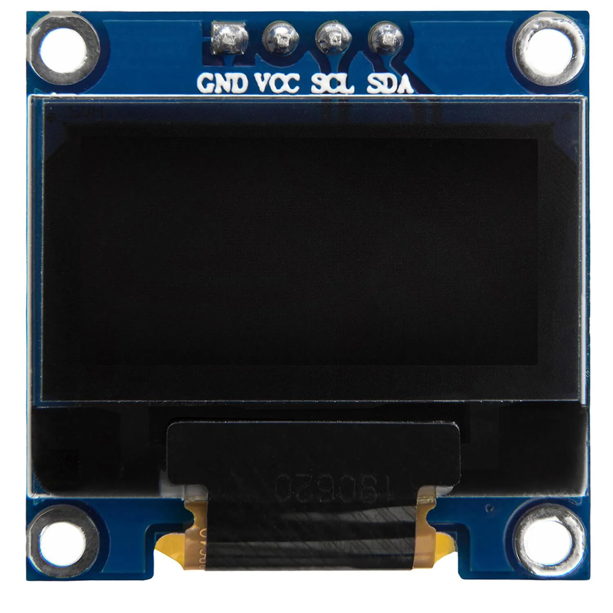
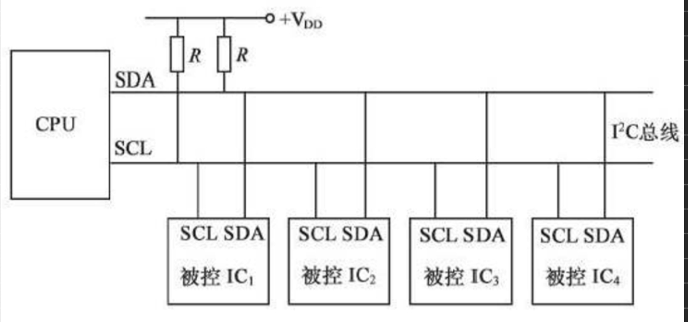
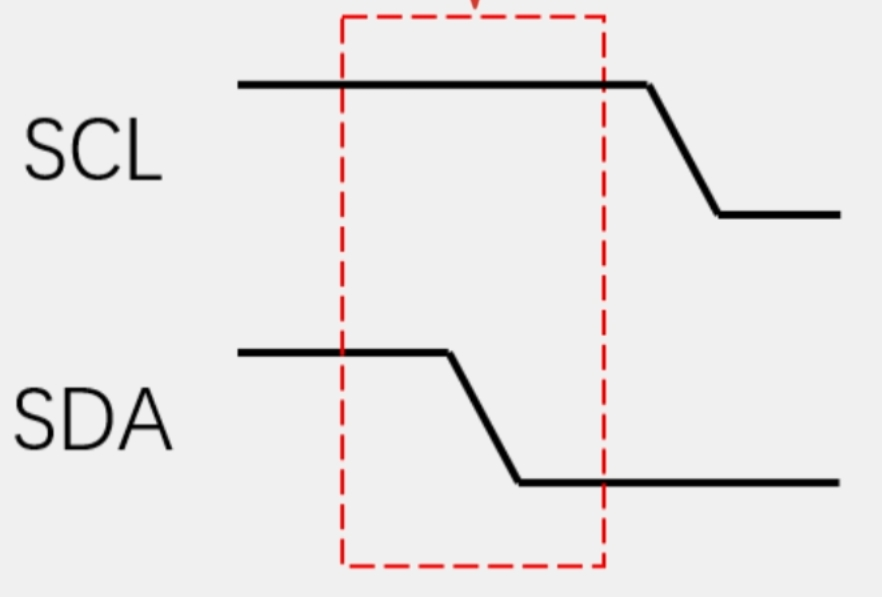
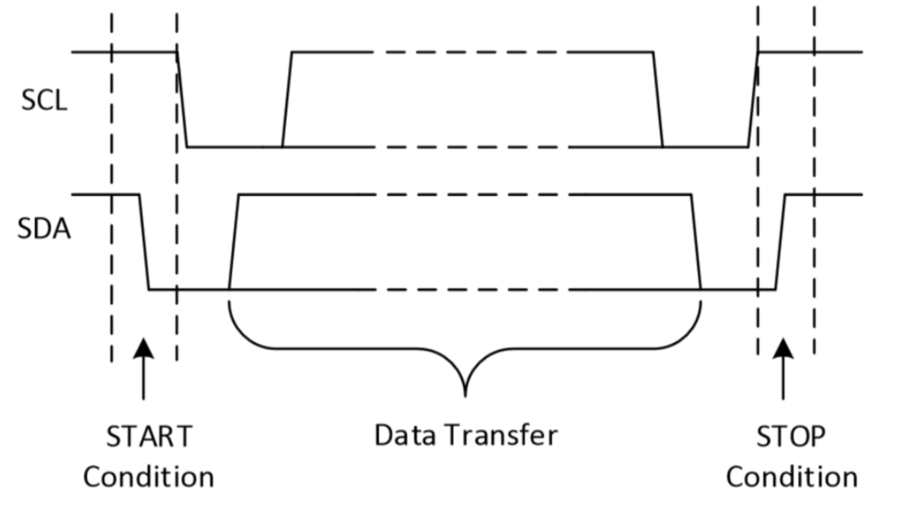
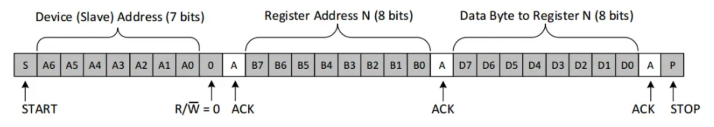
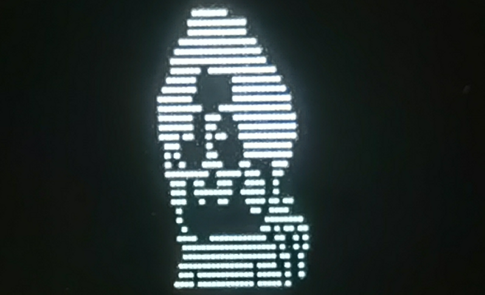

###  SSD1306

SSD1306是一种小型单色（通常为白色或蓝色）有机发光二极管（OLED）显示屏驱动芯片，广泛用于嵌入式系统和电子设备中。这个芯片由Solomon Systech Limited开发，它用于控制OLED显示屏，使其能够显示文本、图像和图形。



开发者可以使用相应的库和驱动程序来与SSD1306芯片进行通信和控制，以在其项目中实现各种自定义图形和文本显示需求。这使得SSD1306成为许多电子制作和嵌入式开发项目中常见的显示解决方案。

### IIC通信

IIC通信，也称为I2C通信（Inter-Integrated Circuit），是一种串行通信协议，用于在数字电路中连接微控制器、传感器、存储器和其他外设设备。这种通信协议由飞利浦半导体开发，现在已经成为一种广泛使用的通信标准。

I2C使用两根线，一根是串行数据线（SDA），另一根是串行时钟线（SCL）。这使得连接和通信变得相对简单。



通信中通常有一个主设备（通常是微控制器或微处理器）和一个或多个从设备（如传感器或存储器）。主设备控制通信的时序。

每个从设备都有一个唯一的7位地址，主设备使用这些地址来选择要通信的从设备。

数据在时钟脉冲的边沿上进行传输，可以是8位字节或更多。通信可以是单向的（读或写）或双向的。

I2C通信常用于连接各种外设，尤其在嵌入式系统和传感器网络中非常常见。这种通信协议具有灵活性和可扩展性，使得设备可以轻松地添加到系统中，并以可控的方式进行通信。

当SCL处于高电平，SDA处于下降沿时开始通信



当SCL处于高电平，SDA处于上升沿时结束通信



一字节前七位为从机地址，第八位为读写标志位



### 源码

```c
#include <Wire.h>                // 引入I2C库
#include <Adafruit_GFX.h>        // 引入Adafruit GFX库
#include <Adafruit_SSD1306.h>    // 引入Adafruit SSD1306 OLED库

#define SCREEN_WIDTH 128  // OLED显示屏的宽度（以像素为单位）
#define SCREEN_HEIGHT 32  // OLED显示屏的高度（以像素为单位）

#define OLED_RESET     -1 // Reset pin # (or -1 if sharing Arduino reset pin)
#define SCREEN_ADDRESS 0x3C
Adafruit_SSD1306 display(SCREEN_WIDTH, SCREEN_HEIGHT, &Wire, -1);

const uint8_t myImage[] = {};
void setup() {
  // 初始化串口通信
  Serial.begin(115200);

  // 设置按钮引脚为输入模式
  pinMode(buttonPin, INPUT_PULLUP); // 使用内部上拉电阻，按钮未按下时为高电平

  // 初始化I2C总线
  Wire.begin(4, 5);  // SDA引脚连接到D2（GPIO4），SCL引脚连接到D1（GPIO5）

  // 初始化OLED显示
  if(!display.begin(SSD1306_SWITCHCAPVCC,SCREEN_ADDRESS)) {
    Serial.println(F("SSD1306分辨率未找到，请确认是否正确连接。"));
    while (true);
  }

  // 清空屏幕
  display.clearDisplay();
}

void loop() {


// 显示图片
  display.drawBitmap(0, 0, myImage, SCREEN_WIDTH, SCREEN_HEIGHT, SSD1306_WHITE);

  // 更新显示
  display.display();

  delay(1000);  // 显示图片一秒钟
}


```

### 结果


