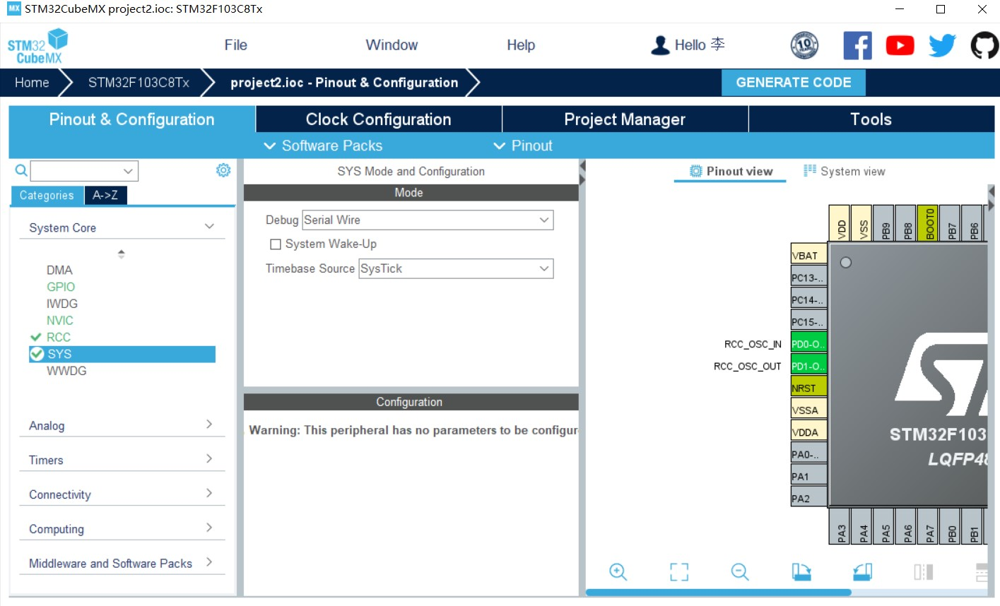
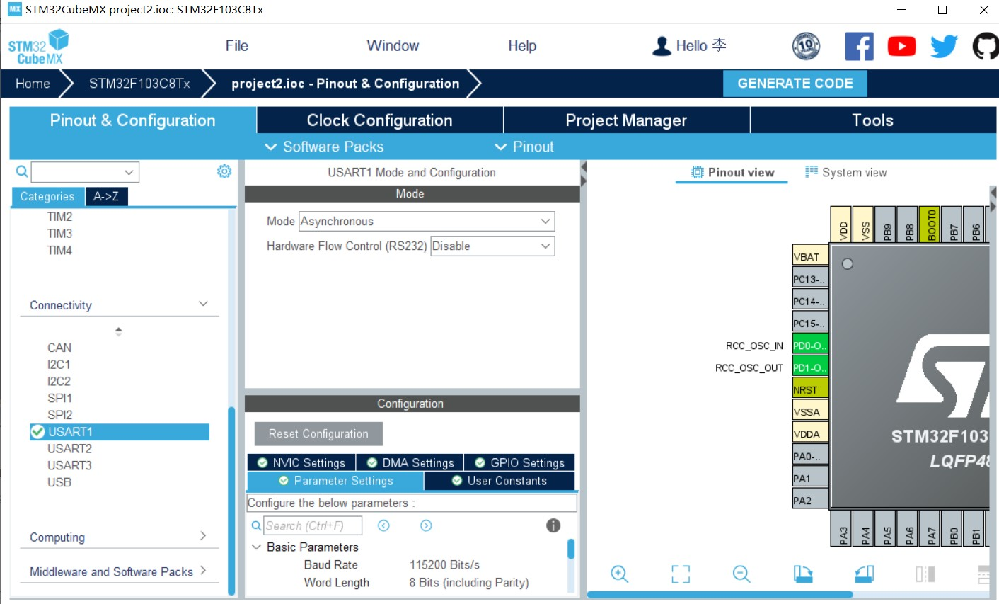
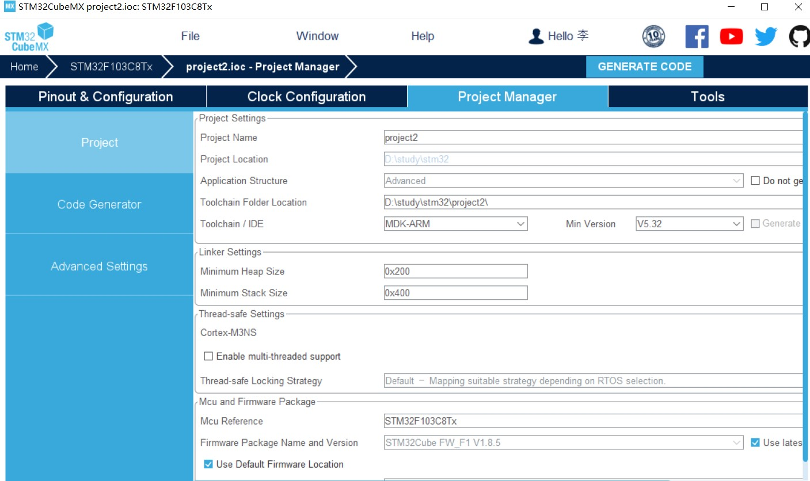
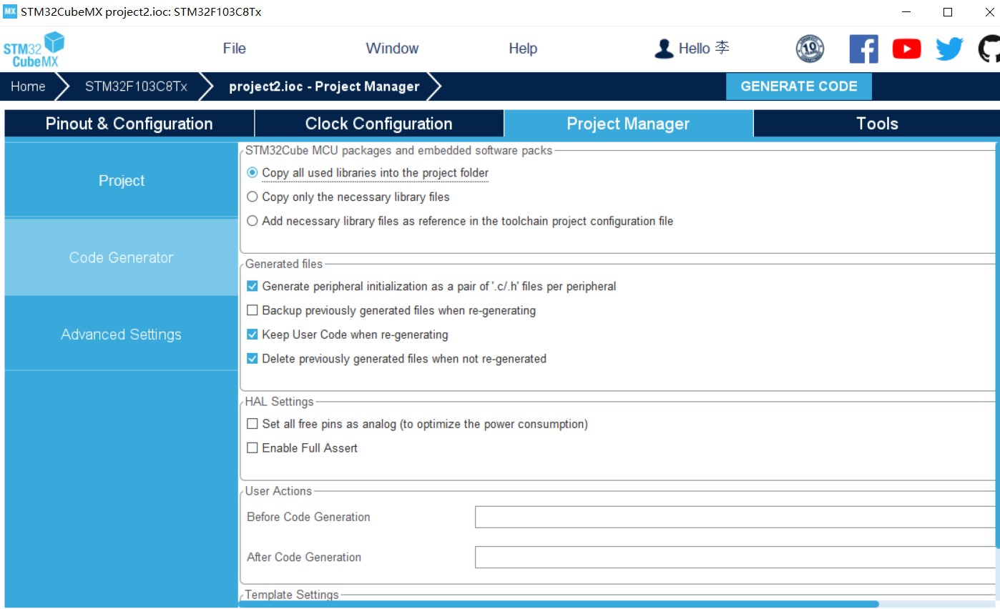
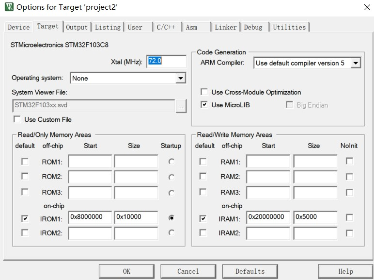
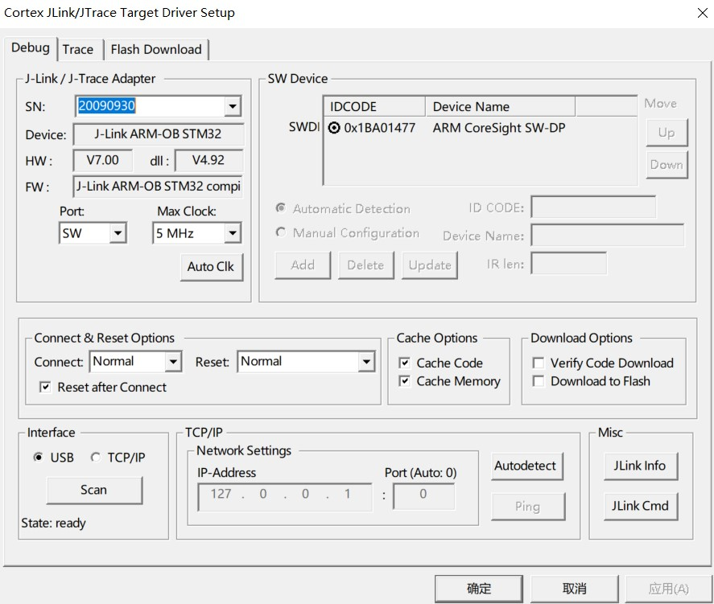
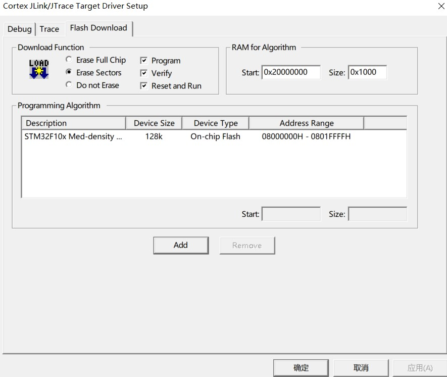
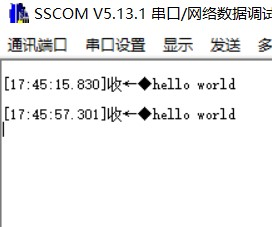

### 创建工程文件

首先使用cubemx建立工程文件

1. Debug选择Serial Wire

2. 串口1Mode选择同步

3. 选择MDK-ARM
4. 勾选生成.c和.h文件

### 代码编写

在usart.c文件中添加fputc函数

```c
/* USER CODE BEGIN 1 */
int fputc(int ch,FILE *f)
{
	HAL_UART_Transmit(&huart1,(uint8_t *)&ch,1,1000);
	return ch;
}
/* USER CODE END 1 */
```

在main.c中导入stdio.h并添加要执行的语句

```c
  /* Initialize all configured peripherals */
  MX_GPIO_Init();
  MX_USART1_UART_Init();
  /* USER CODE BEGIN 2 */
	printf("hello world\n");
  /* USER CODE END 2 */
```

### 下载配置

1. 勾选Use MicroLIB

2. 选择SW

3. 勾选Reset  and  Run

编译并下载至stm32中

### 接收

串口助手设置波特率设为115200


