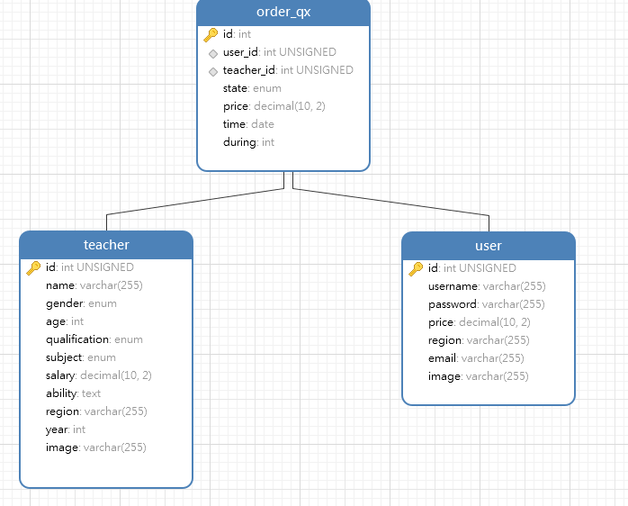

倾心家教结果展示

<!-- more -->

### 环境配置

#### 前端

- 开发工具 `DevEco Studio` 
- 语言 `ArkTS`
- SDK `3.1.0(API9)`

#### 后端

- 开发工具 `IDEA` 
- 语言 `JAVA`
- SDK `OpenJDK 19`

#### 数据库

- 开发工具 `Navicat` 
- 语言 `sql`
- 服务器 `mysql`

### 结果展示

