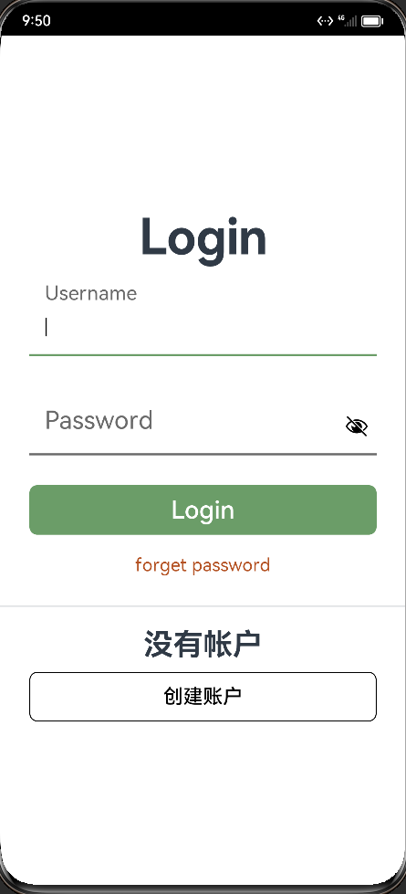

讲解倾心家教前端中http请求源码和登录页源码

<!-- more -->

## http请求

### 1. API

定义请求头数据，使用JSON格式发送数据

```typescript
export class API {
  //服务器地址
  // static readonly Url = 'http://192.168.31.62:8080'
  static readonly Url = 'http://192.168.43.171:8080'
  static readonly login = API.Url + '/login'
  static readonly register = API.Url + '/register'
  static readonly getTeachers = API.Url + '/getTeachers'
  //读取超时
  static readonly HTTP_READ_TIMEOUT = 10 * 1000
  /**
   * Http请求成功的code.
   */
  static readonly HTTP_CODE_200: number = 200;
  /**
   * wanAndroid 接口返回的成功的code.
   */
  static readonly SERVER_CODE_SUCCESS: number = 0;
}

export const enum ContentType {
  JSON = 'application/json'
}
```

### 2. Response

响应数据格式设置

```typescript
export class Response {
  /**
   * Code returned by the network request: success, fail.
   */
  errorCode: number;

  /**
   * Message returned by the network request.
   */
  errorMsg: string | Resource;

  /**
   * Data returned by the network request.
   */
  data: string | Object | ArrayBuffer;

  constructor() {
    this.errorCode = -1;
    this.errorMsg = '';
    this.data = '';
  }
}
```

### 3. get

发送get请求，可以选择是否携带参数。

```typescript
export function get(url: string,data?: any): Promise<Response> {
  let httpRequest = http.createHttp();
  console.log("http test1"+url)
  console.log("http test1"+data)
  let responseResult = httpRequest.request(url, {
    method: http.RequestMethod.GET,
    readTimeout: 15000,
    header: {
      'Content-Type': 'application/json'
    },
    connectTimeout: 15000,
    extraData: data
  });
  let serverData: Response = new Response();
  // Processes the data and returns.
  return responseResult.then((value: http.HttpResponse) => {
    if (value.responseCode === API.HTTP_CODE_200) {
      // Obtains the returned data.
      let result = `${value.result}`;
      console.log("http test1"+result);

      let resultJson: Response = JSON.parse(result);
      //console.error("result2"+JSON.stringify(resultJson))
      if (resultJson.errorCode === API.SERVER_CODE_SUCCESS) {
        serverData.data = resultJson.data;
      }
      serverData.errorCode = resultJson.errorCode;
      serverData.errorMsg = resultJson.errorMsg;
    } else {
      serverData.errorMsg = 'error1';
    }
    return serverData;
  }).catch(() => {
    serverData.errorMsg = 'error2';
    return serverData;
  })
}
```

### 4. post

发送post请求

```typescript
export function post(url: string, data: any): Promise<Response> {
  let httpRequest = http.createHttp();
  console.log("http test2"+url)

  let responseResult = httpRequest.request(url, {
    method: http.RequestMethod.POST,
    readTimeout: 15000,
    header: {
      'Content-Type': 'application/json'
    },
    connectTimeout: 15000,
    extraData: data,
  });

  console.log("http test2"+JSON.stringify(data));
  let serverData: Response = new Response();
  // Processes the data and returns.
  return responseResult.then((value: http.HttpResponse) => {
    if (value.responseCode === API.HTTP_CODE_200) {
      // Obtains the returned data.
      let result = `${value.result}`;
      console.log("http test2"+result);

      let resultJson: Response = JSON.parse(result);
      //console.error("result2"+JSON.stringify(resultJson))
      if (resultJson.errorCode === API.SERVER_CODE_SUCCESS) {
        serverData.data = resultJson.data;
      }
      serverData.errorCode = resultJson.errorCode;
      serverData.errorMsg = resultJson.errorMsg;
    } else {
      serverData.errorMsg = 'error1';
    }
    return serverData;
  }).catch(() => {
    serverData.errorMsg = 'error2';
    return serverData;
  })
}
```

## 登录



### 源码分析

#### 1. 浮动输入框

```typescript
Text("Login")
          .fontSize(50)
          .fontWeight(FontWeight.Bold)
ExInput({rx_input:this.username_input}).margin(10)
ExInput({rx_input:this.pwd_input}).margin(10)
```

##### 1.1 标签属性

```typescript
export class rxLabel {
  Text: string;

  FontSize: number;

  FontSize_Focus: number;
  FontSize_Blur: number;

  Position_x: number;
  Position_y: number;

  Position_Blur_x: number;
  Position_Blur_y: number;

  Position_Focus_x: number;
  Position_Focus_y: number;

  constructor(text: string,
              fontSize: number, fontSize_focus: number,
              position_x: number, position_y: number,
              position_focus_x: number, position_focus_y: number) {
    this.Text = text

    this.FontSize = fontSize
    this.FontSize_Blur = fontSize
    this.FontSize_Focus = fontSize_focus

    this.Position_Blur_x = position_x
    this.Position_Blur_y = position_y

    this.Position_x = position_x
    this.Position_y = position_y

    this.Position_Focus_x = position_focus_x
    this.Position_Focus_y = position_focus_y
  }


}
```

##### 1.2 输入框属性

可以选择是否引用浮动标签，当focus时边框颜色改变，标签缩小并上移

```typescript
export class rxInput {
  Label?: rxLabel;

  FontSize: number;

  BottomColor: string;

  BottomColor_Blur: string
  BottomColor_Focus: string;

  Type: number;
  Value: string = '';

  constructor(type: number = InputType.Normal,fontSize: number, bottomColor: string,
              bottomColor_focus: string, label?: rxLabel)
  {
    this.Type = type
    this.FontSize = fontSize
    this.BottomColor = bottomColor
    this.BottomColor_Blur = bottomColor
    this.BottomColor_Focus = bottomColor_focus
    if (label){
      this.Label = label
    }
  }

  focus(fontSize: number, x?: number, y?: number) {

    if (this.Label != null && x != null && y != null){
      this.Label.FontSize = fontSize
      this.Label.Position_x = x
      this.Label.Position_y = y
    }

    this.BottomColor = this.BottomColor_Focus
  }

  blur(fontSize: number, x?: number, y?: number)
  {
    if (this.Label != null && x != null && y != null && this.Value == ''){
      this.Label.FontSize = fontSize
      this.Label.Position_x = x
      this.Label.Position_y = y
    }

    this.BottomColor = this.BottomColor_Blur
  }

}
```

##### 1.3 输入框构建

使用相对布局对标签和输入框进行布局

```typescript
@Component
export struct ExInput {

  @State private rx_input : rxInput = null;

  build() {
    Column({space: 10}) {
      RelativeContainer() {
        TextInput()
          .id("input")
          .type(this.rx_input.Type)
          .width(350)
          .fontSize(this.rx_input.FontSize)
          .aspectRatio(6)
          .backgroundColor('#ffffff')
          .caretColor(Color.Black)
          .border({
            color: this.rx_input.BottomColor,
            width: {
              bottom: 2
            },
            radius: 0,
            style: BorderStyle.Solid
          })
          .alignRules({
            middle: {
              anchor: "__container__",
              align:HorizontalAlign.Center
            },
            bottom: {
              anchor: "__container__",
              align:VerticalAlign.Bottom
            }
          })
          .onChange((value) => {
            this.rx_input.Value = value;
          })
          .onFocus(() => {
            this.rx_input.focus(
              this.rx_input.Label.FontSize_Focus,
              this.rx_input.Label.Position_Focus_x,
              this.rx_input.Label.Position_Focus_y)
          })
          .onBlur(() => {
            this.rx_input.blur(
              this.rx_input.Label.FontSize_Blur,
              this.rx_input.Label.Position_Blur_x,
              this.rx_input.Label.Position_Blur_y)
          })

        Text(this.rx_input.Label.Text)
          .id("label")
          .fontColor('#6b6b6b')
          .fontSize(this.rx_input.Label.FontSize)
          .position({
            x: this.rx_input.Label.Position_x,
            y: this.rx_input.Label.Position_y
          })
          .animation({
            duration: 300,
            curve: Curve.Friction,
            playMode: PlayMode.Normal
          })
      }
      .width("100%")
      .height(80)
      .backgroundColor(Color.White)
    }
  }
}
```

##### 1.4 输入框使用

先定义一个label对象，在生成一个input对象，使用EXinput时将input对象设为状态

```typescript
username_label = new rxLabel('Username',AppFontSize.LARGER,AppFontSize.LARGE,35,30,35,5)
username_input = new rxInput(InputType.Normal,AppFontSize.LARGER,'#6b6b6b','#6b9d68',this.username_label)

pwd_label = new rxLabel('Password',AppFontSize.LARGER,AppFontSize.LARGE,35,30,35,5)
pwd_input = new rxInput(InputType.Password,AppFontSize.LARGER,'#6b6b6b','#6b9d68',this.pwd_label)
  
build() {
	Column() {
    	Text("Login")
          .fontSize(50)
          .fontWeight(FontWeight.Bold)
        ExInput({rx_input:this.username_input}).margin(10)
        ExInput({rx_input:this.pwd_input}).margin(10)
        
    }
}
```

#### 2. Dialog

##### 2.1 自定义Dialog

自定义Dialog， 展示errorMsg，点击按钮后关闭弹窗

```typescript
@CustomDialog struct CustomBatteryDialog {
  @Link errorMessage: string

  private controller: CustomDialogController; // 定义controller

  build() {
    Stack() {
      Column() {
        Text('登录失败')
          .fontSize(20)
          .margin({top: 15})
        Text(this.errorMessage)
          .fontSize(20)
          .fontColor($r('app.color.theme_color_red'))
          .margin({top: 15})
        Text()
          .size({width: "100%", height: "2px"})
          .backgroundColor("#bebbc1")
          .margin({top: 15})
        Text("确认")
          .textAlign(TextAlign.Center)
          .fontSize(18)
          .fontColor("#317ef5")
          .height(50)
          .onClick(() => {
            this.controller.close(); // 关闭弹窗
          })
      }
      .backgroundColor("#e6ffffff")
      .borderRadius(20)
    }
    .padding({left: 40, right: 40})
    .width("100%")
  }
}
```

##### 2.2 使用Dialog

```typescript
  // 创建一个controller
  controller: CustomDialogController = new CustomDialogController({
    builder: CustomBatteryDialog({errorMessage: $errorMessage}), // 弹框的构造器
    cancel: () => {
      console.log("cancel")         // 点击蒙层的回调
    },
    autoCancel: true,               // 允许点击蒙层关闭弹窗
    customStyle: true               // 使用自定义样式
  });

this.controller.open()  // 打开弹窗
```

#### 3. 登录请求

调用get函数，参数设置为用户名和密码，返回一个promise，若errcode为success则接受，否则拒绝

```typescript
public  login(username,password): Promise<User> {

    return new Promise((resolve: Function, reject: Function) => {
      let url = API.login+"?username="+username+"&password="+password
      get(url).then((data: Response) => {
        if (data.errorCode === API.SERVER_CODE_SUCCESS) {
          resolve(data.data);
        } else {
          console.error('login failed1', JSON.stringify(data));
          reject('用户名或密码错误');
        }
      }).catch((err: Error) => {
        console.error('login failed2', JSON.stringify(err));
        reject('error4');
      });
```

调用login，获取到用户对象后将这个对象设置为全局对象，全局对象中loginIF设置为true，若登陆失败则打开弹窗

```typescript
  requestLogin(){
    this.LoadController.open();
    viewModel.login(this.user.username,this.user.password).then((data: User) => {
      this.LoadController.close();
      console.log("http test2"+JSON.stringify(data))
      this.user = data;
      globalThis.user = this.user;
      globalThis.loginIF = true;
      router.pushUrl({
        url: "pages/test"
      })
    }).catch((err: string) => {
        this.LoadController.close();
        this.errorMessage = err;
        this.controller.open()  // 打开弹窗
    })
  }
```


