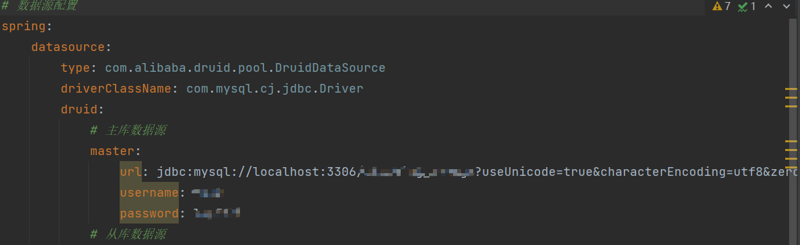

使用若依框架快速开发江苏大学教学管理系统

<!-- more -->

使用若依框架快速开发江苏大学教学管理系统

## 1. 配置若依

### 1.1 下载若依

> 下载地址 https://gitee.com/y_project/RuoYi-Vue
>
> RuoYi 是一个 Java EE 企业级快速开发平台，基于经典技术组合（Spring Boot、Apache Shiro、MyBatis、Thymeleaf、Bootstrap），内置模块如：部门管理、角色用户、菜单及按钮授权、数据权限、系统参数、日志管理、通知公告等。在线定时任务配置；支持集群，支持多数据源，支持分布式事务。


### 1.2 环境配置

- JDK >= 1.8 (推荐1.8版本)
- Mysql >= 5.7.0 (推荐5.7版本)
- Maven >= 3.0

- redis(可选)

> 下载若依源码后使用ide打开文件可以看到以下结构


#### 1.2.1 生成系统所需表

将sql文件夹中的两个sql文件在自己的数据库中运行

运行成功后会生成大量的表，其中较为**重要(之后修改代码可能会用到的)**的有以下几个

|     表名      |                             作用                             |
| :-----------: | :----------------------------------------------------------: |
| sys_dict_type |             字典类型，可用于下拉框选择和映射关系             |
| sys_dict_data |                       字典中的具体数据                       |
|   sys_menu    | 侧边栏中的菜单，如果运行了生成的sql语句后后悔,可在该表中删除相应记录 |
|   sys_role    |       系统角色，只需在网页对该表进行处理，无需修改代码       |
|   sys_user    |                            用户表                            |

#### 1.2.2 数据库配置

1. 打开配置文件


2. 修改相应字段



#### 1.2.3 Redis 配置

1. 打开application.yml文件

2. 修改相应字段

   

### 1.3 启动若依

1. 启动redis服务

2. 启动后端项目

3. 进入ruoyi-ui目录

4. 输入指令

   ```shell
   // 初次启动时需要输入第一个指令
   npm install
   npm run dev
   ```

## 2. 二次开发

### 2.1 自定义模块

> 我的groupId仍是以com.ruoyi，如果想用自己的，需要在正确位置添加需要扫描的字段

1. 创建一个新的模块

2. 添加ruoyi-common依赖

   ```java
   <dependency>
      <groupId>com.ruoyi</groupId>
      <artifactId>ruoyi-common</artifactId>
   </dependency>
   ```

3. 在整个项目的pom.xml下添加该模块

   ```java
   <modules>
       <module>ruoyi-admin</module>
       <module>ruoyi-framework</module>
       <module>ruoyi-system</module>
       <module>ruoyi-quartz</module>
       <module>ruoyi-generator</module>
       <module>ruoyi-common</module>
       <module>rx_teaching</module>
    </modules>
   ```

4. 在ruoyi-admin目录的pom.xml添加依赖

   ```java
           <!--我的模块-->
           <dependency>
               <groupId>com.ruoyi</groupId>
               <artifactId>rx_teaching</artifactId>
               <version>${ruoyi.version}</version>
           </dependency>
   ```

### 2.2 代码生成

1. 导入表


2. 基本信息


3. 字段信息


4. 生成信息


5. 提交后生成代码，将压缩包解压获得以下文件，将sql文件运行


6. 将main文件夹下的两个文件夹复制到main目录下


7. 将vue文件夹下的两个文件复制到src目录下


8. 重新启动前后端


### 2.3 添加字典

- 字典名称为选择字典时显示的名称
- 字典类型为字典数据存储时使用


#### 2.3.1 手动添加字典数据


- 数据标签为界面显示的文字
- 数据键值为该标签对应的数据。(例如男是标签，1是键值)


#### 2.3.2 自动添加字典数据

在数据库中添加触发器，再插入一条数据时自动为字典插入数据

```sql
BEGIN
    DECLARE d_sort INT;
    SET d_sort = (SELECT MAX(dict_sort) FROM sys_dict_data WHERE dict_type = 'rx_college');
    INSERT INTO sys_dict_data (dict_sort, dict_label, dict_value, dict_type, list_class ) VALUES (NEW.year_id, NEW.`name`, NEW.year_id, 'aca_year', 'default');
END
```

### 2.4 自动注册

自动注册则不能使用触发器在数据库中添加数据因为用户密码时经过加密的。使用触发器添加的密码则是没有加密的。

修改注册参数。


修改提交函数，导入login.js中的register，添加注册表单。

```vue
      registerForm: {
        username: "",
        password: "",
        confirmPassword: "",
        code: "",
        uuid: ""
      },

	/** 提交按钮 */
    submitForm() {
      this.$refs["form"].validate(valid => {
        if (valid) {
          if (this.form.id != null) {
            updateStudent(this.form).then(response => {
              this.$modal.msgSuccess("修改成功");
              this.open = false;
              this.getList();
            });
          } else {
            this.registerForm.username = this.form.stuId
            this.registerForm.password = this.form.stuId
            this.registerForm.confirmPassword = this.form.stuId
            addStudent(this.form).then(response => {

              this.$modal.msgSuccess("新增成功");

              this.open = false;
              this.getList();
            });
          }

          register(this.registerForm)
        }
      });
    },
```

### 2.5 数据可见

```vue
  created() {
    this.queryParams.teacherId = this.$store.getters.name
    this.getList();
  },
```

### 结果

#### 登录


#### 首页


#### 管理员

1. 教师管理

   

2. 学生管理

   

3. 学年管理

   

4. 学院管理

   

5. 专业管理

   

6. 专业学分管理

   

#### 教师

1. 个人信息查询

   

2. 教授课程

   

3. 课程时间

   

#### 学生

1. 选课

   

2. 个人信息查询

   

3. 课程表

   

4. 成绩查询

   

5. 学业情况查询

   

