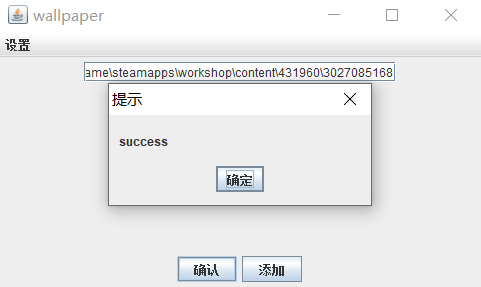

### 起因

几日前在wallpaper上看到了不错的壁纸，想要将图片保存。奈何已经忘了应该怎么做，只得再次Google。为避免之后再次发生这种情况，决定开发一个简单的程序可以方便地提取wallpaper壁纸。

> 提取wallpaper壁纸方法参考 https://blog.csdn.net/qq_35632833/article/details/124307471

### 构思

程序较为简单，只要将给出的路径文件复制到RePKG文件夹下，后通过powershell的接口运行设定好的指令，再将输出的文件复制至目标文件夹下并删除多余文件即可。

### 文件操作

#### 文件复制

```java
    //文件夹的拷贝
    public static void copyDir(String sourcePath, String newPath) {
        File start = new File(sourcePath);
        File end = new File(newPath);
        String[] filePath = start.list();		//获取该文件夹下的所有文件以及目录的名字
        if(!end.exists()) {
            end.mkdir();
        }
        for(String temp:filePath) {
            //查看其数组中每一个是文件还是文件夹
            if(new File(sourcePath+File.separator+temp).isDirectory()) {
                //为文件夹，进行递归
                copyDir(sourcePath+File.separator+temp, newPath+File.separator+temp);
            }else {
                //为文件则进行拷贝
                copyFile(sourcePath+File.separator+temp, newPath+File.separator+temp);
            }
        }
    }

    //文件的拷贝
    public static void copyFile(String sourcePath, String newPath) {
        File start = new File(sourcePath);
        File end = new File(newPath);
        try(BufferedInputStream bis=new BufferedInputStream(new FileInputStream(start));
            BufferedOutputStream bos=new BufferedOutputStream(new FileOutputStream(end))) {
            int len = 0;
            byte[] flush = new byte[1024];
            while((len=bis.read(flush)) != -1) {
                bos.write(flush, 0, len);
            }
            bos.flush();
        }catch(FileNotFoundException e) {
            e.printStackTrace();
        }catch(IOException e) {
            e.printStackTrace();
        }
    }
```

#### 文件删除

```java
  public static void delete (String dir) throws IOException{

        Path directory = Paths.get(dir);
        Files.walkFileTree(directory, new SimpleFileVisitor<Path>() {
            @Override
            public FileVisitResult visitFile(Path file, BasicFileAttributes attributes) throws IOException {
                Files.delete(file); // 有效，因为它始终是一个文件
                return FileVisitResult.CONTINUE;
            }

            @Override
            public FileVisitResult postVisitDirectory(Path dir, IOException exc) throws IOException {
                Files.delete(dir); //这将起作用，因为目录中的文件已被删除
                return FileVisitResult.CONTINUE;
            }
        });
    }

```

#### 目录创建

```java
    public static void createDir( String directoryPath) {

        Path path = Paths.get(directoryPath);

        try {
            Files.createDirectory(path);
            System.out.println("目录已创建");
        } catch (IOException e) {
            System.err.println("无法创建目录：" + e);
        }
    }
```

### powershell

原本powershell的代码参考的文章https://blog.csdn.net/Controller000/article/details/130532775

但在运行过程中总是报以下警告

> 九月 15, 2023 9:06:35 下午 com.profesorfalken.jpowershell.PowerShell closeAndWait 警告: Powershell process cannot be closed. Session seems to be blocked 
>
> 九月 15, 2023 9:06:35 下午 com.profesorfalken.jpowershell.PowerShell close 信息: Forcing PowerShell to close. PID: 3816

疑似阻塞导致强行关闭对话，私以为是由于运行时间较长导致的误判，且强行关闭会导致部分文件输出不全

```java
/**
     *
     * 多条powershell命令演示
     * 1. 进入 D:\
     * 2. 创建一个文件夹 mkdir ps_test
     * 3.将 powershell版本信息输入到 a.txt文件中
     *
     */
    public static void execMulCmd(){
        // 开始时间
        long stime = System.currentTimeMillis();
 
 
        //1.打开一个powershell会话
        PowerShell ps = PowerShell.openSession();
        ps.executeCommand("cd \\");
        //2.进入 D:\
        ps.executeCommand("D:");
        //3.创建一个文件夹
        ps.executeCommand("mkdir ps_test");
        ps.executeCommand("cd ps_test");
        //4.将 host 信息写入 a.txt
        ps.executeCommand(" host > a.txt");
        //5.关闭powershell
        ps.close();
        System.out.println("ps command exec success!");
 
 
        // 结束时间
        long etime = System.currentTimeMillis();
        System.err.println("程序执行了 "+((etime-stime)/1000)+" s");
    }
```

还好一位名为chatgpt的朋友热心地帮助了我，给了我以下代码

```java
import java.io.BufferedReader;
import java.io.IOException;
import java.io.InputStreamReader;

public class powershellCmd {
    public static void shellEXE() {
        String powerShellScriptPath = ".\\myScript.ps1"; // 脚本文件路径
        int timeoutInSeconds = 600; // 设置超时时间为10分钟（以秒为单位）

        try {
            ProcessBuilder processBuilder = new ProcessBuilder("powershell.exe", "-File", powerShellScriptPath);
            Process process = processBuilder.start();

            // 创建标准输出流的读取器
            BufferedReader reader = new BufferedReader(new InputStreamReader(process.getInputStream()));
            String line;

            while ((line = reader.readLine()) != null) {
                // 处理 PowerShell 命令的输出
                System.out.println(line);
            }

            // 等待 PowerShell 进程完成，但不超过超时时间
            if (process.waitFor(timeoutInSeconds, java.util.concurrent.TimeUnit.SECONDS)) {
                System.out.println("PowerShell 命令已完成。");
            } else {
                System.out.println("PowerShell 命令超时。");
                // 可以选择在此处执行其他操作，如终止进程
            }
        } catch (IOException | InterruptedException e) {
            e.printStackTrace();
        }
    }
}


```

#### 脚本文件

```shell
cd RePKG文件夹位置
.\repkg extract -o ./output RePKG文件夹位置
```

### GUI

```java
public class gui {
    public static String RePKG = ""; //RePKG文件夹位置
    public static String output = ""; //输出文件夹位置
    Set <JTextField> fieldSet = new HashSet<>();

    JFrame jFrame = new JFrame("wallpaper");
    JPanel jPanelbut = new JPanel();
    JPanel jPanelcentre = new JPanel();
    //创建菜单栏
    JMenuBar jMenuBar = new JMenuBar();
    JMenu fileMenu = new JMenu("设置");

    JTextField jTextField = new JTextField(28) ;

    JButton confirm = new JButton("确认");
    JButton add = new JButton("添加");

    JMenuItem src = new JMenuItem(new AbstractAction("repkg文件夹") {
        @Override
        public void actionPerformed(ActionEvent e) {
            //显示一个文件选择器
            JFileChooser jFileChooser = new JFileChooser(RePKG); //当前项目路径
            jFileChooser.setFileSelectionMode(JFileChooser.DIRECTORIES_ONLY);
            jFileChooser.showOpenDialog(jFrame);
            //获取用户选择的文件
            File file = jFileChooser.getSelectedFile();
            RePKG = file.getPath();
        }
    });
    JMenuItem dest = new JMenuItem(new AbstractAction("目标文件夹") {
        @Override
        public void actionPerformed(ActionEvent e) {
            //显示一个文件选择器
            JFileChooser jFileChooser = new JFileChooser(output); //当前项目路径
            jFileChooser.setFileSelectionMode(JFileChooser.DIRECTORIES_ONLY);
            jFileChooser.showSaveDialog(jFrame);
            //获取用户选择的保存文件路径
            File file = jFileChooser.getSelectedFile();
            output = file.getPath();
        }
    });


    //组装视图
    public void init() {
        fieldSet.add(jTextField);

        fileMenu.add(src);
        fileMenu.add(dest);
        jMenuBar.add(fileMenu);

        jPanelcentre.add(jTextField);

        jPanelbut.add(confirm);
        jPanelbut.add(add);

        jFrame.add(jPanelcentre,BorderLayout.CENTER);
        jFrame.add(jPanelbut,BorderLayout.SOUTH);
        jFrame.setJMenuBar(jMenuBar);


        confirm.addActionListener(new ActionListener()
        {
            public void actionPerformed (ActionEvent e)
            {
                int i = 0;
                int length = fieldSet.size();
                String[] sourcePath = new String[length];
                String[] sourceName = new String[length];
                String[] dest1 = new String[length];
                String[] dest2 = new String[length];
                String[] out = new String[length];

                //获取文本框内容
                for (JTextField textField : fieldSet) {
                    sourcePath[i] = textField.getText();
                    File source = new File(sourcePath[i]);
                    sourceName[i] = source.getName();
                    dest1[i] = new StringBuilder(RePKG).append("\\"+sourceName[i]).toString();
                    fileOP.createDir(dest1[i]);
                    fileOP.copyDir(sourcePath[i] , dest1[i]);
                    i++;
                }

                powershellCmd.shellEXE();

                //删除多余文件
                for (int j = 0; j < length; j++) {
                    out[j] = new StringBuilder(RePKG).append("\\output\\"+sourceName[j]).toString();


                    dest2[j] = new StringBuilder(output).append("\\"+sourceName[j]).toString();
                    fileOP.createDir(dest2[j]);
                    //System.out.println(out+dest2);
                    fileOP.copyDir(out[j] , dest2[j]);
                    try {
                        fileOP.delete(dest1[j]);
                    } catch (IOException ex) {
                        throw new RuntimeException(ex);
                    }
                    try {
                        fileOP.delete(out[j]);
                    } catch (IOException ex) {
                        throw new RuntimeException(ex);
                    }
                }

                //提示
                JOptionPane.showMessageDialog(jFrame,"success","提示",JOptionPane.PLAIN_MESSAGE);

            }
        });

        //添加文本框
        add.addActionListener(new ActionListener()
        {
            public void actionPerformed (ActionEvent e){
                JTextField newTextField = new JTextField(28);
                jPanelcentre.add(newTextField);
                fieldSet.add(newTextField);
                jFrame.revalidate();;
                System.out.println("success");
            }

        });

        //通过pack()方法设置最佳大小
        jFrame.pack();
        //设置Frame的位置和大小
        jFrame.setBounds(400, 200, 500, 300);
        //设置Frame可见
        jFrame.setVisible(true);
        jFrame.setDefaultCloseOperation(JFrame.EXIT_ON_CLOSE);
    }

    public static void main(String[] args) {
        new gui().init();
    }
}
```

### 结果



程序是完成了，感觉并没有简便很多，只是能防止我忘了该怎么获取壁纸。但做完这个项目后，获取壁纸的流程已经烂熟于心了，so，这个项目说实话有些鸡肋了。

### 不足

1. repkg和目标文件夹位置以及脚本命令只能在源码中配置，在图形界面中配置repkg和目标文件夹只是暂时的
2. 对repkg输出的文件进行复制删除，其实可以直接用文件移动解决
3. 原打算在目标文件夹中根据日期创建目录对输出的文件进行分类，在完成项目时忽略了

> 获取源码可访问https://github.com/rxlxr11/wallpaper
